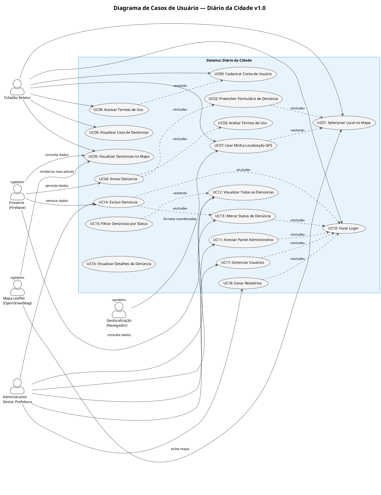
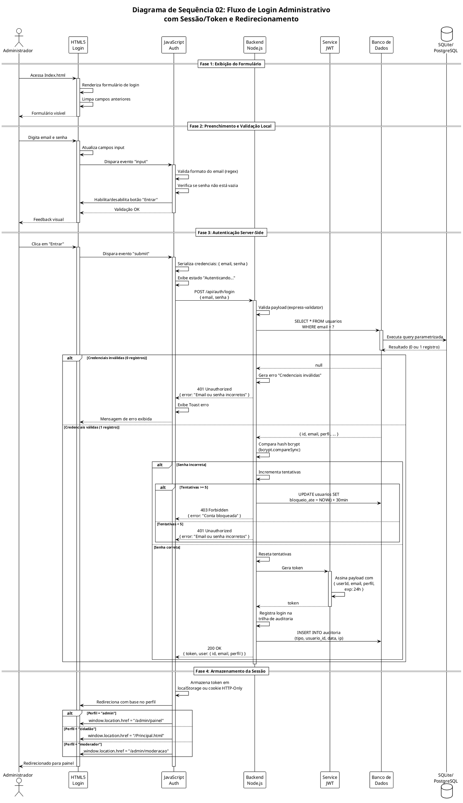
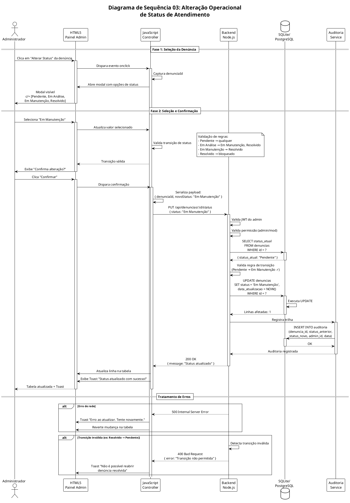
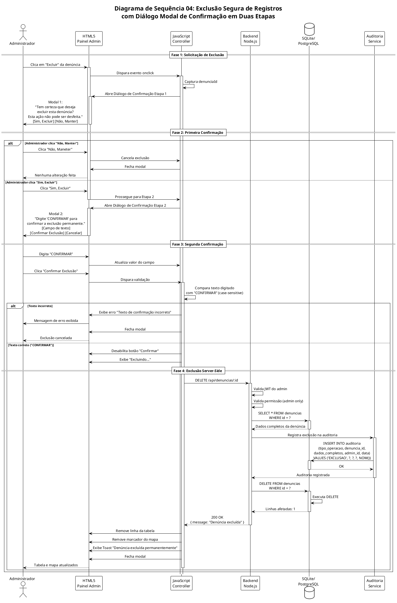

# Requisitos de Usuário — Diário da Cidade


Marcar no Mapa: O cidadão seleciona o local exato do problema (buraco, quebra-molas, etc.) no mapa de Barra do Garças.

Anexar Foto e Descrição: Adiciona uma foto comprovando a situação e escreve um breve relato do caso.

Acompanhar e Filtrar: O usuário visualiza o status (Pendente, Em Manutenção, Resolvido) e pode filtrar problemas no mapa.

Gestão e Baixa: O gestor da prefeitura atualiza o andamento do chamado e remove/encerra o registro quando o problema for resolvido.

**Projeto:** Diário da Cidade — Plataforma de Denúncias Urbanas  
**Versão:** 1.0  
**Data:** 02 de setembro de 2026  
**Conformidade:** UML 2.5.1, ISO/IEC/IEEE 29148:2018, FURPS+/ISO/IEC 25010  
**Cidade-Alvo:** Barra do Garças — MT  

---

## Sumário

1. [Identificação e Caracterização dos Atores](#1-identificação-e-caracterização-dos-atores)
2. [Diagrama de Casos de Uso](#2-diagrama-de-casos-de-uso)
3. [Catálogo de Requisitos de Usuário (RU)](#3-catálogo-de-requisitos-de-usuário-ru)
4. [Histórias de Usuário e Critérios de Aceite BDD/Gherkin](#4-histórias-de-usuário-e-critérios-de-aceite-bddgherkin)
5. [Diagramas de Sequência](#5-diagramas-de-sequência)

---

## 1. Identificação e Caracterização dos Atores

### 1.1 Definição de Ator (UML 2.5.1)

Um **ator** é uma entidade externa que interage com o sistema desempenhando um ou mais papéis. Atores podem ser humanos primários, humanos secundários ou sistemas/serviços externos.

### 1.2 Atores Humanos Primários

#### A1 — Cidadão Relator

| Atributo | Descrição |
|----------|-----------|
| **Nome** | Cidadão Relator |
| **Estereótipo** | `<<actor>>` humano primário |
| **Descrição** | Qualquer cidadão residente ou transeunte na cidade de Barra do Garças que deseja registrar uma denúncia sobre problemas urbanos |
| **Objetivo Principal** | Reportar problemas de infraestrutura urbana com localização georreferenciada |
| **Nível de Conhecimento** | Básico — usuário final de aplicação web pública, sem necessidade de conhecimento técnico |
| **Frequência de Uso** | Esporádica a moderada (conforme surgimento de problemas na cidade) |
| **Acessibilidade** | Precisa de interface responsiva, compatível com dispositivos móveis e desktop |
| **Perfil de Segurança** | Anônimo ou autenticado opcionalmente — dados de relato são públicos |

#### A2 — Administrador/Gestor Prefeitura

| Atributo | Descrição |
|----------|-----------|
| **Nome** | Administrador/Gestor Prefeitura |
| **Estereótipo** | `<<actor>>` humano primário |
| **Descrição** | Funcionário ou gestor da Prefeitura Municipal de Barra do Garças responsável por receber, analisar e dar andamento às denúncias |
| **Objetivo Principal** | Gerenciar o ciclo de vida das denúncias: visualizar, atribuir status, encaminhar para órgãos responsáveis e registrar resolução |
| **Nível de Conhecimento** | Intermediário — familiarizado com ferramentas de gestão pública e painéis administrativos |
| **Frequência de Uso** | Diária durante horário comercial |
| **Acessibilidade** | Acesso restrito via autenticação (login/senha + JWT) |
| **Perfil de Segurança** | Autenticado e autorizado — acesso ao painel administrativo e funcionalidades de gestão |

### 1.3 Atores Humanos Secundários

#### A3 — Moderador/Operador de Suporte

| Atributo | Descrição |
|----------|-----------|
| **Nome** | Moderador/Operador de Suporte |
| **Estereótipo** | `<<actor>>` humano secundário |
| **Descrição** | Operador que realiza tarefas de moderação de conteúdo, verificação de denúncias duplicadas e suporte técnico aos cidadãos |
| **Objetivo Principal** | Manter a qualidade e integridade dos dados registrados, resolver duplicidades e auxiliar cidadãos com dificuldades |
| **Nível de Conhecimento** | Intermediário |
| **Frequência de Uso** | Diária |
| **Perfil de Segurança** | Autenticado com permissões intermediárias (moderação) |

### 1.4 Atores Sistêmicos (Sistemas Externos)

#### A4 — Serviço de Geolocalização (Navegador)

| Atributo | Descrição |
|----------|-----------|
| **Nome** | Serviço de Geolocalização |
| **Estereótipo** | `<<system>>` / `<<external>>` |
| **Descrição** | API de geolocalização nativa do navegador (Geolocation API W3C) que fornece coordenadas GPS do dispositivo do usuário |
| **Objetivo** | Obter latitude e longitude atuais do dispositivo para preenchimento automático do campo de localização |
| **Protocolo de Integração** | JavaScript API (`navigator.geolocation.getCurrentPosition()`) via HTTPS |
| **Confiabilidade** | Depende do hardware do dispositivo e permissão do usuário — pode falhar ou ser negado |

#### A5 — Serviço de Mapa (Leaflet/OpenStreetMap)

| Atributo | Descrição |
|----------|-----------|
| **Nome** | Serviço de Mapa |
| **Estereótipo** | `<<system>>` / `<<external>>` |
| **Descrição** | Biblioteca JavaScript Leaflet.js integrada a tiles do OpenStreetMap para exibição interativa de mapa georreferenciado |
| **Objetivo** | Renderizar mapa, permitir seleção de local, exibir marcadores de denúncias e suportar interação de arrasto |
| **Protocolo de Integração** | CDN HTTPS — Leaflet v1.9.4 + tiles OSM |
| **Confiabilidade** | Alta — serviço open-source gratuito, sujeito a limites de uso |

#### A6 — Banco de Dados Firestore (Firebase)

| Atributo | Descrição |
|----------|-----------|
| **Nome** | Banco de Dados Firestore |
| **Estereótipo** | `<<system>>` / `<<external>>` |
| **Descrição** | Serviço de banco de dados NoSQL em nuvem (Firebase Firestore) utilizado para persistência das denúncias registradas |
| **Objetivo** | Armazenar, recuperar e sincronizar em tempo real os registros de denúncias dos cidadãos |
| **Protocolo de Integração** | Firebase SDK v10.12.2 via CDN HTTPS |
| **Confiabilidade** | Alta — SLA Google Cloud, replicação automática |

#### A7 — Serviço de Autenticação (Firebase Auth / localStorage)

| Atributo | Descrição |
|----------|-----------|
| **Nome** | Serviço de Autenticação |
| **Estereótipo** | `<<system>>` / `<<external>>` |
| **Descrição** | Mecanismo de autenticação responsável por validar credenciais de login do administrador e gerenciar sessões |
| **Objetivo** | Garantir que apenas administradores autorizados acessem o painel de gestão |
| **Protocolo de Integração** | Atualmente: localStorage (proposta: JWT + Backend Node.js) |
| **Confiabilidade** | Variável — implementação atual usa localStorage (inseguro); versão proposta usa JWT (seguro) |

### 1.5 Tabela Consolidada de Atores

| ID | Nome | Tipo | Estereótipo | Autenticação | Nível de Acesso |
|----|------|------|-------------|--------------|-----------------|
| A1 | Cidadão Relator | Humano Primário | `<<actor>>` | Opcional/Anônimo | Público — CRUD de denúncias |
| A2 | Administrador/Gestor | Humano Primário | `<<actor>>` | Obrigatório (JWT) | Admin — Gerenciamento completo |
| A3 | Moderador/Operador | Humano Secundário | `<<actor>>` | Obrigatório (JWT) | Moderação — Verificação e suporte |
| A4 | Geolocalização | Sistêmico | `<<system>>` | N/A | Leitura de coordenadas |
| A5 | Mapa (Leaflet/OSM) | Sistêmico | `<<system>>` | N/A | Renderização e interação |
| A6 | Firestore | Sistêmico | `<<system>>` | Chave de API | CRUD de dados |
| A7 | Autenticação | Sistêmico | `<<system>>` | Credenciais | Validação de sessão |

---

## 2. Diagrama de Casos de Uso

### 2.1 Diagrama de Casos de Uso Principal (PlantUML)



### 2.2 Legenda dos Relacionamentos

| Tipo | Notação | Descrição |
|------|---------|-----------|
| `<<include>>` | Seta tracejada com `<<include>>` | Relacionamento obrigatório — o caso base sempre inclui o caso incluído |
| `<<extend>>` | Seta tracejada com `<<extend>>` | Relacionamento opcional — o caso estendido é executado sob condição específica |

### 2.3 Tabela de Mapeamento Atores × Casos de Uso

| Caso de Uso | A1 | A2 | A3 | A4 | A5 | A6 |
|-------------|:--:|:--:|:--:|:--:|:--:|:--:|
| UC01: Selecionar Local no Mapa | X | | | | X | |
| UC02: Preencher Formulário de Denúncia | X | | | | | |
| UC03: Aceitar Termos de Uso | X | | | | | |
| UC04: Enviar Denúncia | X | | | | | X |
| UC05: Visualizar Denúncias no Mapa | X | | | | X | X |
| UC06: Visualizar Lista de Denúncias | X | | | | | X |
| UC07: Usar Minha Localização GPS | X | | | X | | |
| UC08: Acessar Termos de Uso | X | | | | | |
| UC09: Cadastrar Conta de Usuário | X | | | | | |
| UC10: Fazer Login | X | X | X | | | |
| UC11: Acessar Painel Administrativo | | X | | | | |
| UC12: Visualizar Todas as Denúncias | | X | X | | | X |
| UC13: Alterar Status de Denúncia | | X | | | | X |
| UC14: Excluir Denúncia | | X | | | | X |
| UC15: Filtrar Denúncias por Status | | X | X | | | |
| UC16: Visualizar Detalhes da Denúncia | | X | X | | | X |
| UC17: Gerenciar Usuários | | X | | | | X |
| UC18: Gerar Relatórios | | X | | | | X |

---

## 3. Catálogo de Requisitos de Usuário (RU)

### 3.1 RU01 — Selecionar Local no Mapa

| Campo | Valor |
|-------|-------|
| **Identificador** | RU01 |
| **Caso de Uso** | UC01 |
| **Título** | Selecionar Local no Mapa |
| **Ator Principal** | A1 — Cidadão Relator |
| **Prioridade (MoSCoW)** | Must Have |
| **Pré-condições** | 1. O usuário acessou a página principal (Principal.html). 2. O mapa Leaflet está carregado e renderizado. 3. O usuário clicou no botão "Reportar Problema". |
| **Pós-condições (Sucesso)** | Um marcador é inserido no mapa na posição clicada. As coordenadas (latitude, longitude) são capturadas e preenchidas automaticamente no formulário. |
| **Pós-condições (Falha)** | Nenhuma alteração é feita. Exibição de mensagem de erro via Toast/DOM. |

**Fluxo Operacional Principal:**

1. O sistema exibe o mapa interativo centrado em Barra do Garças (-15.890, -52.256).
2. O usuário clica no botão "Reportar Problema".
3. O sistema ativa o modo de seleção — altera o cursor para `crosshair` e exibe instrução visual "Clique no mapa para marcar o local".
4. O usuário clica em um ponto do mapa.
5. O sistema insere um marcador (pin) na posição clicada.
6. O sistema captura as coordenadas `lat` e `lng` do ponto clicado.
7. O sistema preenche automaticamente o campo "Localização" do formulário com o texto "Latitude: {lat} | Longitude: {lng}".
8. O sistema torna o marcador arrastável (draggable) para ajuste fino.
9. O sistema abre o painel lateral com o formulário de denúncia.

**Fluxos Alternativos:**

- **4a. Usuário clica fora da área de Barra do Garças:** O sistema permite, mas exibe aviso de que a denúncia pode não ser atendida pelo órgão local.
- **8a. Usuário arrasta o marcador:** O sistema atualiza as coordenadas em tempo real conforme o arrasto.

**Fluxo de Exceção:**

- **E1. Mapa falha ao carregar (sem internet):** O sistema exibe mensagem "Erro ao carregar o mapa. Verifique sua conexão." e desabilita o botão "Reportar Problema".

---

### 3.2 RU02 — Preencher Formulário de Denúncia

| Campo | Valor |
|-------|-------|
| **Identificador** | RU02 |
| **Caso de Uso** | UC02 |
| **Título** | Preencher Formulário de Denúncia |
| **Ator Principal** | A1 — Cidadão Relator |
| **Prioridade (MoSCoW)** | Must Have |
| **Pré-condições** | 1. O marcador foi inserido no mapa (RU01). 2. O painel lateral está aberto com o formulário visível. |
| **Pós-condições (Sucesso)** | Todos os campos obrigatórios estão preenchidos e validados localmente. O botão "Enviar" está habilitado. |
| **Pós-condições (Falha)** | Campos inválidos são destacados com borda vermelha e mensagens de erro inline. |

**Fluxo Operacional Principal:**

1. O sistema exibe o formulário com os campos: Tipo de Problema (select), Descrição (textarea), Localização (input readonly preenchido), Termo de Uso (checkbox).
2. O usuário seleciona o "Tipo de Problema" no campo `<select>` com as opções: "Buraco na rua", "Lixo acumulado", "Luz apagada", "Água parada", "Outro".
3. Se o usuário selecionar "Outro", o sistema exibe um campo adicional "Especificar Tipo" (`<input text>`).
4. O usuário digita a "Descrição" do problema (obrigatório, mínimo 10 caracteres, máximo 1000 caracteres).
5. O sistema valida em tempo real: contador de caracteres, sanitização do texto contra XSS.
6. O sistema exibe o campo "Localização" somente leitura com as coordenadas pré-preenchidas.
7. O usuário marca o checkbox "Li e aceito os Termos de Uso".
8. O sistema valida que todos os campos obrigatórios estão preenchidos.
9. O sistema habilita o botão "Enviar Denúncia".

**Fluxos Alternativos:**

- **2a. Usuário não seleciona tipo:** O campo fica vazio e o sistema exibe erro "Selecione o tipo de problema" ao tentar enviar.
- **4a. Descrição com menos de 10 caracteres:** O sistema exibe aviso "Descrição deve ter pelo menos 10 caracteres" e mantém botão desabilitado.
- **7a. Usuário não marca o termo:** O sistema mantém o botão "Enviar" desabilitado.

**Fluxo de Exceção:**

- **E1. Input do usuário contém tentativa de XSS:** O sistema sanitiza o conteúdo via `escaparHTML()` usando `textContent` antes de injetar no DOM.

---

### 3.3 RU03 — Aceitar Termos de Uso

| Campo | Valor |
|-------|-------|
| **Identificador** | RU03 |
| **Caso de Uso** | UC03 |
| **Título** | Aceitar Termos de Uso |
| **Ator Principal** | A1 — Cidadão Relator |
| **Prioridade (MoSCoW)** | Must Have |
| **Pré-condições** | 1. O formulário de denúncia está visível. 2. O checkbox de termos está exibido. |
| **Pós-condições (Sucesso)** | O checkbox está marcado. O campo `termoAceito` é definido como `true` no payload. |
| **Pós-condições (Falha)** | O checkbox permanece desmarcado. O envio da denúncia é bloqueado. |

**Fluxo Operacional Principal:**

1. O sistema exibe o checkbox com texto "Li e aceito os Termos de Uso" e um link para "Termos de Uso".
2. O usuário clica no link "Termos de Uso".
3. O sistema abre a página `Termos de Uso.html` em nova aba/janela.
4. O usuário lê os termos (5 seções: Autorização, Responsabilidade, Moderação, Direito de Resposta, LGPD).
5. O usuário retorna ao formulário.
6. O usuário marca o checkbox.
7. O sistema valida a marcação e habilita o envio.

**Fluxos Alternativos:**

- **2a. Usuário não clica no link:** O sistema permite marcar o checkbox sem abrir os termos, mas exibe aviso "Recomendamos ler os termos antes de aceitar".

---

### 3.4 RU04 — Enviar Denúncia

| Campo | Valor |
|-------|-------|
| **Identificador** | RU04 |
| **Caso de Uso** | UC04 |
| **Título** | Enviar Denúncia |
| **Ator Principal** | A1 — Cidadão Relator |
| **Prioridade (MoSCoW)** | Must Have |
| **Pré-condições** | 1. Todos os campos obrigatórios estão preenchidos (RU01, RU02, RU03). 2. O checkbox de termos está marcado. 3. Conexão com a internet está disponível. |
| **Pós-condições (Sucesso)** | A denúncia é persistida no Firestore com status "Pendente". Um Toast de confirmação é exibido. O formulário é resetado. O marcador é removido do mapa. |
| **Pós-condições (Falha)** | A denúncia NÃO é persistida. Mensagem de erro é exibida via Toast. O formulário permanece preenchido para correção. |

**Fluxo Operacional Principal:**

1. O usuário clica no botão "Enviar Denúncia".
2. O sistema valida localmente todos os campos (client-side validation).
3. O sistema sanitiza os dados de entrada contra XSS.
4. O sistema serializa os dados em payload JSON: `{ tipo, descricao, endereco, lat, lng, termoAceito: true, dataEnvio: serverTimestamp() }`.
5. O sistema exibe estado de loading no botão ("Enviando...").
6. O sistema envia os dados via Firebase SDK (`addDoc(collection(db, "reclamacoes"), payload)`).
7. O Firestore persiste o documento e retorna o ID gerado.
8. O sistema exibe Toast de sucesso: "Denúncia enviada com sucesso! Obrigado por contribuir com a cidade."
9. O sistema reseta o formulário.
10. O sistema remove o marcador do mapa.
11. O sistema recarrega a lista de denúncias para incluir a nova.

**Fluxos Alternativos:**

- **6a. Firestore retorna erro de rede:** O sistema exibe Toast de erro: "Erro ao enviar. Verifique sua conexão e tente novamente." O formulário permanece preenchido.
- **6b. Firestore retorna erro de permissão:** O sistema exibe Toast de erro: "Erro de permissão. Tente novamente mais tarde."

**Fluxo de Exceção:**

- **E1. Usuário fecha o navegador durante envio:** A denúncia pode ser perdida. O sistema não tem mecanismo de fila offline no estado atual.

---

### 3.5 RU05 — Visualizar Denúncias no Mapa

| Campo | Valor |
|-------|-------|
| **Identificador** | RU05 |
| **Caso de Uso** | UC05 |
| **Título** | Visualizar Denúncias no Mapa |
| **Ator Principal** | A1 — Cidadão Relator |
| **Prioridade (MoSCoW)** | Must Have |
| **Pré-condições** | 1. O mapa está carregado. 2. Existem denúncias registradas no Firestore. |
| **Pós-condições (Sucesso)** | Marcadores coloridos são exibidos no mapa对应cada denúncia. Cada marcador possui popup com informações resumidas. |

**Fluxo Operacional Principal:**

1. O sistema consulta a coleção `reclamacoes` no Firestore, ordenada por `dataEnvio` decrescente.
2. Para cada documento retornado, o sistema cria um marcador (pin) no mapa.
3. O sistema posiciona o marcador nas coordenadas `lat` e `lng` do documento.
4. O sistema vincula um popup ao marcador contendo: Tipo, Descrição (truncada a 100 caracteres), Endereço e Data de Envio formatada.
5. O usuário clica em um marcador.
6. O sistema exibe o popup com os dados da denúncia.

**Fluxos Alternativos:**

- **1a. Nenhuma denúncia existe:** O mapa é exibido sem marcadores. Uma mensagem "Nenhuma denúncia registrada ainda" pode ser exibida.
- **1a. Erro de rede ao consultar Firestore:** O sistema exibe Toast de erro e mantém o mapa vazio.

---

### 3.6 RU06 — Visualizar Lista de Denúncias

| Campo | Valor |
|-------|-------|
| **Identificador** | RU06 |
| **Caso de Uso** | UC06 |
| **Título** | Visualizar Lista de Denúncias |
| **Ator Principal** | A1 — Cidadão Relator |
| **Prioridade (MoSCoW)** | Must Have |
| **Pré-condições** | 1. Existem denúncias registradas no Firestore. 2. O painel lateral está acessível. |
| **Pós-condições (Sucesso)** | Lista ordenada cronologicamente (mais recente primeiro) é exibida no painel lateral. |

**Fluxo Operacional Principal:**

1. O sistema consulta a coleção `reclamacoes` ordenada por `dataEnvio` decrescente.
2. Para cada documento, o sistema renderiza um card na lista com: Tipo, Descrição (truncada), Data formatada e status "Pendente".
3. O sistema exibe a lista no painel lateral direito da tela.
4. O usuário rola a lista para visualizar todas as denúncias.

**Fluxos Alternativos:**

- **2a. Lista vazia:** O sistema exibe "Nenhuma denúncia encontrada".

---

### 3.7 RU07 — Usar Minha Localização GPS

| Campo | Valor |
|-------|-------|
| **Identificador** | RU07 |
| **Caso de Uso** | UC07 |
| **Título** | Usar Minha Localização GPS |
| **Ator Principal** | A1 — Cidadão Relator |
| **Prioridade (MoSCoW)** | Should Have |
| **Pré-condições** | 1. O dispositivo do usuário possui GPS/hardware de geolocalização. 2. O navegador suporta Geolocation API. 3. O usuário concede permissão de localização. |
| **Pós-condições (Sucesso)** | O mapa centraliza na posição GPS do usuário. Um marcador é inserido na localização atual. |
| **Pós-condições (Falha)** | Mensagem de erro é exibida. O mapa permanece na posição padrão. |

**Fluxo Operacional Principal:**

1. O usuário clica no botão "Minha Localização".
2. O sistema solicita permissão de geolocalização ao navegador (`navigator.geolocation.getCurrentPosition()`).
3. O navegador exibe popup de permissão ao usuário.
4. O usuário autoriza.
5. O navegador retorna as coordenadas (latitude, longitude, precisão).
6. O sistema centraliza o mapa na posição GPS com zoom apropriado.
7. O sistema insere um marcador na localização atual.
8. As coordenadas são preenchidas no formulário.

**Fluxos Alternativos:**

- **4a. Usuário nega permissão:** O sistema exibe Toast: "Permissão de localização negada. Selecione o local manualmente no mapa."
- **5a. GPS retorna erro:** O sistema exibe Toast: "Não foi possível obter sua localização. Verifique as configurações do dispositivo."

---

### 3.8 RU08 — Acessar Termos de Uso

| Campo | Valor |
|-------|-------|
| **Identificador** | RU08 |
| **Caso de Uso** | UC08 |
| **Título** | Acessar Termos de Uso |
| **Ator Principal** | A1 — Cidadão Relator |
| **Prioridade (MoSCoW)** | Must Have |
| **Pré-condições** | Nenhuma |
| **Pós-condições (Sucesso)** | O usuário visualiza a página completa dos Termos de Uso com 5 seções legais. |

**Fluxo Operacional Principal:**

1. O usuário clica no link "Termos de Uso" no formulário ou no rodapé.
2. O sistema abre a página `Termos de Uso.html` em nova aba.
3. O sistema exibe os 5 capítulos dos termos:
   - Autorização de Publicação e Difusão
   - Responsabilidade Civil e Penal Exclusiva
   - Critérios de Moderação e Exclusão
   - Garantia do Direito de Resposta
   - Sigilo de Identidade e LGPD
4. O usuário lê os termos.
5. O usuário fecha a aba e retorna ao formulário.

---

### 3.9 RU09 — Cadastrar Conta de Usuário

| Campo | Valor |
|-------|-------|
| **Identificador** | RU09 |
| **Caso de Uso** | UC09 |
| **Título** | Cadastrar Conta de Usuário |
| **Ator Principal** | A1 — Cidadão Relator |
| **Prioridade (MoSCoW)** | Must Have |
| **Pré-condições** | 1. O usuário não possui conta. 2. O usuário acessou a página de cadastro. |
| **Pós-condições (Sucesso)** | Conta criada. Credenciais salvas. Redirecionamento para login. |
| **Pós-condições (Falha)** | Mensagem de erro exibida. Formulário permanece preenchido. |

**Fluxo Operacional Principal:**

1. O usuário clica no link "Criar conta" na página de login.
2. O sistema redireciona para `cadastrar.html`.
3. O sistema exibe formulário com campos: Email, Senha, Confirmar Senha.
4. O usuário preenche os campos.
5. O sistema valida: email em formato válido, senhas coincidem, senha mínima 6 caracteres.
6. O usuário clica em "Cadastrar".
7. O sistema cria o registro (atualmente no Firestore ou proposta: Backend Node.js).
8. O sistema exibe mensagem de sucesso.
9. O sistema redireciona para `Index.html` (login).

**Fluxos Alternativos:**

- **5a. Senhas não coincidem:** Erro "As senhas não conferem".
- **5b. Email já cadastrado:** Erro "Este email já está em uso".
- **5c. Senha fraca:** Erro "A senha deve ter pelo menos 6 caracteres".

---

### 3.10 RU10 — Fazer Login

| Campo | Valor |
|-------|-------|
| **Identificador** | RU10 |
| **Caso de Uso** | UC10 |
| **Título** | Fazer Login |
| **Ator Principal** | A1 — Cidadão Relator / A2 — Administrador |
| **Prioridade (MoSCoW)** | Must Have |
| **Pré-condições** | 1. O usuário possui conta cadastrada. 2. O usuário está na página de login. |
| **Pós-condições (Sucesso)** | Sessão autenticada criada. Redirecionamento para a página apropriada (cidadão → Principal.html; admin → painel administrativo). |
| **Pós-condições (Falha)** | Mensagem de erro "Email ou senha incorretos". Formulário permanece preenchido. |

**Fluxo Operacional Principal:**

1. O usuário acessa `Index.html`.
2. O sistema exibe formulário de login com campos: Email, Senha.
3. O usuário preenche email e senha.
4. O usuário clica em "Entrar".
5. O sistema valida o email e senha contra o banco de dados.
6. Se válido: O sistema cria token JWT (proposta) ou grava sessão no localStorage.
7. O sistema redireciona para `Principal.html` (cidadão) ou painel admin (administrador).
8. Se inválido: O sistema exibe "Email ou senha incorretos".

**Fluxos Alternativos:**

- **5a. Usuário não existe:** Tratamento idêntico a senha incorreta (por segurança).
- **5a. Conta bloqueada por tentativas:** O sistema exibe "Conta temporariamente bloqueada. Tente novamente em X minutos."

---

### 3.11 RU11 — Acessar Painel Administrativo

| Campo | Valor |
|-------|-------|
| **Identificador** | RU11 |
| **Caso de Uso** | UC11 |
| **Título** | Acessar Painel Administrativo |
| **Ator Principal** | A2 — Administrador/Gestor Prefeitura |
| **Prioridade (MoSCoW)** | Must Have |
| **Pré-condições** | 1. O usuário está autenticado como A2. 2. Possui token JWT válido. |
| **Pós-condições (Sucesso)** | Painel administrativo é carregado com todas as denúncias, filtros e opções de gerenciamento. |
| **Pós-condições (Falha)** | Redirecionamento para login com mensagem "Acesso não autorizado". |

**Fluxo Operacional Principal:**

1. O administrador acessa a URL do painel administrativo.
2. O sistema verifica o token JWT no cabeçalho `Authorization: Bearer <token>`.
3. O sistema valida a assinatura e tempo de expiração do token.
4. Se válido: O sistema carrega o painel com dados do administrador e lista de denúncias.
5. Se inválido: O sistema redireciona para `Index.html` com mensagem de erro.

---

### 3.12 RU12 — Visualizar Todas as Denúncias (Admin)

| Campo | Valor |
|-------|-------|
| **Identificador** | RU12 |
| **Caso de Uso** | UC12 |
| **Título** | Visualizar Todas as Denúncias |
| **Ator Principal** | A2 — Administrador |
| **Prioridade (MoSCoW)** | Must Have |
| **Pré-condições** | 1. Administrador autenticado. 2. Painel administrativo carregado. |
| **Pós-condições (Sucesso)** | Tabela com todas as denúncias é exibida com colunas: ID, Tipo, Descrição, Localização, Data, Status. |

**Fluxo Operacional Principal:**

1. O sistema consulta a coleção `reclamacoes` no Firestore.
2. O sistema ordena por `dataEnvio` decrescente.
3. O sistema renderiza tabela HTML com todas as denúncias.
4. Cada linha exibe: ID truncado, Tipo, Descrição (truncada), Coordenadas, Data formatada, Status atual.
5. O administrador pode ordenar e filtrar a tabela.

---

### 3.13 RU13 — Alterar Status de Denúncia

| Campo | Valor |
|-------|-------|
| **Identificador** | RU13 |
| **Caso de Uso** | UC13 |
| **Título** | Alterar Status de Denúncia |
| **Ator Principal** | A2 — Administrador |
| **Prioridade (MoSCoW)** | Must Have |
| **Pré-condições** | 1. Administrador autenticado. 2. Denúncia selecionada na lista. 3. Status atual diferente de "Resolvido". |
| **Pós-condições (Sucesso)** | Status da denúncia é atualizado no Firestore. A visualização é atualizada. Trilha de auditoria é registrada. |
| **Pós-condições (Falha)** | Mensagem de erro. Status permanece inalterado. |

**Fluxo Operacional Principal:**

1. O administrador localiza a denúncia na tabela.
2. O administrador clica no botão "Alterar Status" da linha.
3. O sistema exibe modal com opções de status: "Pendente", "Em Análise", "Em Manutenção", "Resolvido".
4. O administrador seleciona o novo status.
5. O sistema exibe diálogo de confirmação: "Confirma alteração do status para [novo status]?"
6. O administrador confirma.
7. O sistema atualiza o campo `status` no documento Firestore.
8. O sistema registra trilha de auditoria: `{ denunciaId, statusAnterior, statusNovo, dataAlteracao, administradorId }`.
9. O sistema atualiza a visualização da tabela.
10. O sistema exibe Toast: "Status atualizado com sucesso."

**Fluxos Alternativos:**

- **5a. Administrador cancela:** Nenhuma alteração é feita.
- **4a. Tentativa de alterar para "Pendente" a partir de "Resolvido":** Sistema bloqueia — "Não é possível reabrir uma denúncia resolvida."

---

### 3.14 RU14 — Excluir Denúncia

| Campo | Valor |
|-------|-------|
| **Identificador** | RU14 |
| **Caso de Uso** | UC14 |
| **Título** | Excluir Denúncia (Exclusão Segura em Duas Etapas) |
| **Ator Principal** | A2 — Administrador |
| **Prioridade (MoSCoW)** | Must Have |
| **Pré-condições** | 1. Administrador autenticado. 2. Denúncia selecionada. |
| **Pós-condições (Sucesso)** | Denúncia removida permanentemente do Firestore. Trilha de auditoria registrada. Visualização atualizada. |
| **Pós-condições (Falha)** | Denúncia permanece intacta. Mensagem de erro exibida. |

**Fluxo Operacional Principal:**

1. O administrador clica no botão "Excluir" da denúncia.
2. O sistema exibe **Diálogo de Confirmação Etapa 1**: "Tem certeza que deseja excluir esta denúncia? Esta ação não pode ser desfeita."
3. O administrador clica "Sim, Excluir".
4. O sistema exibe **Diálogo de Confirmação Etapa 2**: "Digite 'CONFIRMAR' para confirmar a exclusão permanente."
5. O sistema apresenta campo de texto para digitação.
6. O administrador digita "CONFIRMAR".
7. O sistema valida se o texto digitado corresponde exatamente a "CONFIRMAR" (case-sensitive).
8. O sistema envia solicitação de exclusão para o Firestore (`deleteDoc(doc(db, "reclamacoes", id))`).
9. O Firestore confirma a remoção.
10. O sistema registra trilha de auditoria: `{ denunciaId, dataExclusao, administradorId, dadosCompletos }`.
11. O sistema atualiza a tabela removendo a linha.
12. O sistema remove o marcador correspondente do mapa.
13. O sistema exibe Toast: "Denúncia excluída permanentemente."

**Fluxos Alternativos:**

- **3a. Administrador clica "Não, Manter":** Nenhuma alteração. Diálogo fecha.
- **7a. Texto digitado não confere:** Sistema exibe "Texto de confirmação incorreto. Exclusão cancelada." Diálogo fecha.
- **8a. Erro de rede na exclusão:** Sistema exibe "Erro ao excluir. Tente novamente."

---

### 3.15 RU15 — Filtrar Denúncias por Status

| Campo | Valor |
|-------|-------|
| **Identificador** | RU15 |
| **Caso de Uso** | UC15 |
| **Título** | Filtrar Denúncias por Status |
| **Ator Principal** | A2 — Administrador / A3 — Moderador |
| **Prioridade (MoSCoW)** | Should Have |
| **Pré-condições** | 1. Painel administrativo carregado. 2. Denúncias existentes. |
| **Pós-condições (Sucesso)** | Lista filtrada pelas denúncias que correspondem ao status selecionado. |

**Fluxo Operacional Principal:**

1. O sistema exibe barra de filtros com botões/abas: "Todas", "Pendentes", "Em Análise", "Em Manutenção", "Resolvidas".
2. O administrador clica em um filtro.
3. O sistema aplica filtro na visualização (client-side se poucos registros, server-side se muitos).
4. A tabela é atualizada exibindo apenas denúncias do status selecionado.
5. O contador de resultados é atualizado.

---

### 3.16 RU16 — Visualizar Detalhes da Denúncia

| Campo | Valor |
|-------|-------|
| **Identificador** | RU16 |
| **Caso de Uso** | UC16 |
| **Título** | Visualizar Detalhes da Denúncia |
| **Ator Principal** | A2 — Administrador / A3 — Moderador |
| **Prioridade (MoSCoW)** | Should Have |
| **Pré-condições** | 1. Denúncia selecionada. 2. Administrador/Moderador autenticado. |
| **Pós-condições (Sucesso)** | Modal/página de detalhes exibe todas as informações da denúncia, incluindo dados completos de localização e histórico de status. |

**Fluxo Operacional Principal:**

1. O administrador clica no botão "Detalhes" ou no ID da denúncia.
2. O sistema busca o documento completo no Firestore.
3. O sistema exibe modal/página com:
   - ID da denúncia
   - Tipo (com ícone correspondente)
   - Descrição completa (sem truncamento)
   - Coordenadas (lat/lng) com link para Google Maps
   - Data/hora do envio
   - Status atual
   - Histórico de alterações de status (trilha de auditoria)
4. O administrador fecha o modal.

---

### 3.17 RU17 — Gerenciar Usuários

| Campo | Valor |
|-------|-------|
| **Identificador** | RU17 |
| **Caso de Uso** | UC17 |
| **Título** | Gerenciar Usuários |
| **Ator Principal** | A2 — Administrador |
| **Prioridade (MoSCoW)** | Could Have |
| **Pré-condições** | 1. Administrador autenticado com permissão de gestão de usuários. |
| **Pós-condições (Sucesso)** | Lista de usuários é exibida. Administrador pode visualizar, alterar permissões e desativar contas. |

**Fluxo Operacional Principal:**

1. O administrador acessa a seção "Usuários" no painel.
2. O sistema carrega a lista de usuários do Firestore (coleção `usuarios`).
3. O sistema exibe tabela com: Nome, Email, Perfil (Cidadão/Admin/Moderador), Status (Ativo/Inativo), Data de Cadastro.
4. O administrador pode:
   - Alterar perfil de um usuário
   - Ativar/Desativar conta
   - Visualizar histórico de denúncias do usuário

---

### 3.18 RU18 — Gerar Relatórios

| Campo | Valor |
|-------|-------|
| **Identificador** | RU18 |
| **Caso de Uso** | UC18 |
| **Título** | Gerar Relatórios |
| **Ator Principal** | A2 — Administrador |
| **Prioridade (MoSCoW)** | Could Have |
| **Pré-condições** | 1. Administrador autenticado. 2. Dados de denúncias disponíveis. |
| **Pós-condições (Sucesso)** | Relatório gerado com estatísticas e exportação em PDF/CSV. |

**Fluxo Operacional Principal:**

1. O administrador acessa a seção "Relatórios" no painel.
2. O sistema exibe filtros: período (data inicial/final), tipo de problema, status.
3. O administrador seleciona os filtros desejados.
4. O sistema calcula estatísticas: total de denúncias, por tipo, por status, tempo médio de resolução.
5. O sistema gera gráficos (barras, pizza) com distribuição de denúncias.
6. O administrador pode exportar em PDF ou CSV.

---

## 4. Histórias de Usuário e Critérios de Aceite BDD/Gherkin

### HU01 — Selecionar Local no Mapa

**Como** cidadão de Barra do Garças,  
**Quero** selecionar o local exato do problema no mapa interativo,  
**Para que** a prefeitura saiba exatamente onde está o problema e possa agir com precisão.

**Critérios de Aceite (BDD/Gherkin):**

```gherkin
Funcionalidade: Seleção de Local no Mapa
  Como cidadão relator
  Quero marcar o local do problema no mapa
  Para indicar com precisão a localização da denúncia

  Cenário: Selecionar local clicando no mapa
    Dado que o usuário está na página principal com o mapa carregado
    E o botão "Reportar Problema" está visível
    Quando o usuário clica no botão "Reportar Problema"
    E o cursor do mapa muda para "crosshair"
    E o usuário clica em um ponto do mapa
    Então um marcador deve ser inserido no ponto clicado
    E as coordenadas devem ser preenchidas automaticamente no campo "Localização"
    E o painel lateral com o formulário deve ser aberto

  Cenário: Arrastar marcador para ajustar posição
    Dado que um marcador foi inserido no mapa
    Quando o usuário arrasta o marcador para nova posição
    Então as coordenadas devem ser atualizadas em tempo real no formulário

  Cenário: Tentar selecionar local com mapa indisponível
    Dado que o mapa falhou ao carregar (sem conexão)
    Quando o usuário visualiza a página
    Então uma mensagem de erro deve ser exibida
    E o botão "Reportar Problema" deve estar desabilitado
```

---

### HU02 — Preencher Formulário de Denúncia

**Como** cidadão relator,  
**Quero** descrever o problema com tipo, descrição e localização,  
**Para que** a prefeitura tenha todas as informações necessárias para atender.

**Critérios de Aceite (BDD/Gherkin):**

```gherkin
Funcionalidade: Preenchimento do Formulário de Denúncia
  Como cidadão relator
  Quero preencher o formulário com os dados do problema
  Para registrar minha denúncia completa

  Cenário: Preencher formulário com sucesso
    Dado que o painel lateral está aberto com o formulário
    Quando o usuário seleciona "Buraco na rua" no campo "Tipo de Problema"
    E digita "Existe um buraco grande na Rua das Flores, próximo à padaria" no campo "Descrição"
    E marca o checkbox "Li e aceito os Termos de Uso"
    Então o botão "Enviar Denúncia" deve ficar habilitado

  Cenário: Tentar enviar com descrição muito curta
    Dado que o formulário está aberto
    Quando o usuário digita "Buraco" (menos de 10 caracteres) no campo "Descrição"
    Então uma mensagem de erro "Descrição deve ter pelo menos 10 caracteres" deve ser exibida
    E o botão "Enviar Denúncia" deve permanecer desabilitado

  Cenário: Selecionar tipo "Outro" e especificar
    Dado que o formulário está aberto
    Quando o usuário seleciona "Outro" no campo "Tipo de Problema"
    Então um campo adicional "Especificar Tipo" deve aparecer
    E o usuário deve conseguir digitar o tipo customizado

  Cenário: Detectar tentativa de XSS na descrição
    Dado que o formulário está aberto
    Quando o usuário digita "<script>alert('xss')</script>" no campo "Descrição"
    E clica em "Enviar Denúncia"
    Então o sistema deve sanitizar o conteúdo
    E o texto deve ser salvo como texto puro (sem tags HTML/JS)
```

---

### HU03 — Aceitar Termos de Uso

**Como** cidadão relator,  
**Quero** ler e aceitar os termos de uso antes de enviar minha denúncia,  
**Para que** eu esteja ciente das responsabilidades legais do meu relato.

**Critérios de Aceite (BDD/Gherkin):**

```gherkin
Funcionalidade: Aceitação dos Termos de Uso
  Como cidadão relator
  Quero aceitar os termos antes de enviar
  Para estar ciente das responsabilidades

  Cenário: Aceitar termos com sucesso
    Dado que o formulário está aberto
    E o checkbox "Li e aceito os Termos de Uso" está visível
    Quando o usuário marca o checkbox
    Então o campo `termoAceito` deve ser definido como `true`
    E o envio da denúncia deve ser permitido

  Cenário: Não aceitar termos
    Dado que o formulário está aberto
    Quando o usuário tenta enviar sem marcar o checkbox
    Então o botão "Enviar Denúncia" deve permanecer desabilitado

  Cenário: Acessar página de termos
    Dado que o formulário está aberto
    Quando o usuário clica no link "Termos de Uso"
    Então a página "Termos de Uso.html" deve abrir em nova aba
    E os 5 capítulos legais devem ser exibidos
```

---

### HU04 — Enviar Denúncia

**Como** cidadão relator,  
**Quero** enviar minha denúncia com um clique após preencher o formulário,  
**Para que** meu problema seja registrado e possa ser acompanhado.

**Critérios de Aceite (BDD/Gherkin):**

```gherkin
Funcionalidade: Envio de Denúncia
  Como cidadão relator
  Quero enviar minha denúncia
  Para que ela seja registrada no sistema

  Cenário: Enviar denúncia com sucesso
    Dado que todos os campos obrigatórios estão preenchidos corretamente
    E o checkbox de termos está marcado
    E o usuário está online
    Quando o usuário clica em "Enviar Denúncia"
    Então o botão deve mostrar "Enviando..." durante o processo
    E a denúncia deve ser persistida no Firestore
    E um Toast de sucesso "Denúncia enviada com sucesso!" deve ser exibido
    E o formulário deve ser resetado
    E o marcador deve ser removido do mapa
    E a lista de denúncias deve ser atualizada

  Cenário: Falha ao enviar por falta de conexão
    Dado que o formulário está preenchido
    E o usuário está offline
    Quando o usuário clica em "Enviar Denúncia"
    Então um Toast de erro "Erro ao enviar. Verifique sua conexão." deve ser exibido
    E o formulário deve permanecer preenchido

  Cenário: Verificar dados persistidos no Firestore
    Dado que uma denúncia foi enviada com sucesso
    Quando o administrador consulta o Firestore
    Então o documento deve conter: tipo, descricao, endereco, lat, lng, termoAceito=true, dataEnvio
    E o status deve ser "Pendente"
```

---

### HU05 — Visualizar Denúncias no Mapa

**Como** cidadão relator,  
**Quero** ver todas as denúncias marcadas no mapa,  
**Para que** eu saiba quais problemas já foram reportados na minha região.

**Critérios de Aceite (BDD/Gherkin):**

```gherkin
Funcionalidade: Visualização de Denúncias no Mapa
  Como cidadão relator
  Quero ver marcadores no mapa correspondentes às denúncias
  Para acompanhar os problemas reportados

  Cenário: Exibir marcadores no mapa
    Dado que existem denúncias registradas no Firestore
    E o mapa está carregado
    Quando a página é carregada
    Então marcadores devem ser inseridos no mapa对应cada denúncia
    E cada marcador deve ter um popup com tipo, descrição, endereço e data

  Cenário: Clicar em marcador para ver detalhes
    Dado que marcadores estão exibidos no mapa
    Quando o usuário clica em um marcador
    Então um popup deve ser aberto com as informações da denúncia

  Cenário: Nenhuma denúncia registrada
    Dado que não existem denúncias no Firestore
    Quando o mapa é carregado
    Então nenhum marcador deve ser exibido
```

---

### HU06 — Visualizar Lista de Denúncias

**Como** cidadão relator,  
**Quero** ver uma lista das minhas denúncias e de outros cidadãos,  
**Para que** eu possa acompanhar o andamento dos relatos.

**Critérios de Aceite (BDD/Gherkin):**

```gherkin
Funcionalidade: Lista de Denúncias
  Como cidadão relator
  Quero visualizar denúncias em formato lista
  Para acompanhar relatos recentes

  Cenário: Exibir lista ordenada por data
    Dado que existem denúncias registradas
    Quando o painel lateral é aberto
    Então uma lista de cards deve ser exibida
    E os cards devem estar ordenados por data de envio (mais recente primeiro)
    E cada card deve exibir: tipo, descrição truncada e data

  Cenário: Lista vazia
    Dado que não existem denúncias
    Quando o painel lateral é aberto
    Então a mensagem "Nenhuma denúncia encontrada" deve ser exibida
```

---

### HU07 — Usar Minha Localização GPS

**Como** cidadão relator em deslocamento,  
**Quero** usar a localização GPS do meu celular,  
**Para que** a denúncia seja registrada automaticamente no local correto.

**Critérios de Aceite (BDD/Gherkin):**

```gherkin
Funcionalidade: Localização GPS
  Como cidadão relator
  Quero usar minha localização atual
  Para preencher automaticamente a localização

  Cenário: Obter localização com sucesso
    Dado que o dispositivo tem GPS ativo
    E o navegador suporta Geolocation API
    Quando o usuário clica no botão "Minha Localização"
    E autoriza o acesso à localização
    Então o mapa deve centralizar na posição GPS
    E um marcador deve ser inserido na localização atual
    E as coordenadas devem ser preenchidas no formulário

  Cenário: Permissão de localização negada
    Dado que o usuário está na página
    Quando o usuário clica em "Minha Localização"
    E nega a permissão
    Então uma mensagem "Permissão de localização negada" deve ser exibida
    E o mapa deve permanecer na posição padrão

  Cenário: GPS indisponível
    Dado que o dispositivo não tem GPS
    Quando o usuário clica em "Minha Localização"
    Então uma mensagem de erro deve ser exibida
```

---

### HU08 — Acessar Termos de Uso

**Como** cidadão relator,  
**Quero** ler os termos de uso antes de aceitar,  
**Para que** eu conheça meus direitos e deveres.

**Critérios de Aceite (BDD/Gherkin):**

```gherkin
Funcionalidade: Acesso aos Termos de Uso
  Como cidadão relator
  Quero acessar a página de termos
  Para ler as condições legais

  Cenário: Abrir termos em nova aba
    Dado que o formulário está aberto
    Quando o usuário clica no link "Termos de Uso"
    Então a página "Termos de Uso.html" deve abrir em nova aba
    E os 5 capítulos devem ser exibidos

  Cenário: Voltar ao formulário após ler termos
    Dado que a página de termos está aberta em nova aba
    Quando o usuário fecha a aba
    E retorna ao formulário
    Então o formulário deve permanecer com os dados preenchidos
```

---

### HU09 — Cadastrar Conta de Usuário

**Como** novo cidadão,  
**Quero** criar uma conta para gerenciar minhas denúncias,  
**Para que** eu possa acompanhar o histórico dos meus relatos.

**Critérios de Aceite (BDD/Gherkin):**

```gherkin
Funcionalidade: Cadastro de Usuário
  Como novo cidadão
  Quero criar uma conta
  Para gerenciar minhas denúncias

  Cenário: Cadastrar com sucesso
    Dado que o usuário está na página de cadastro
    Quando digita "joao@email.com" no campo Email
    E digita "senha123" no campo Senha
    E digita "senha123" no campo Confirmar Senha
    E clica em "Cadastrar"
    Então a conta deve ser criada
    E uma mensagem de sucesso deve ser exibida
    E o usuário deve ser redirecionado para a página de login

  Cenário: Senhas não conferem
    Dado que o formulário está preenchido
    Quando o usuário digita "senha123" na Senha
    E "senha456" na Confirmar Senha
    Então a mensagem "As senhas não conferem" deve ser exibida

  Cenário: Email já cadastrado
    Dado que "joao@email.com" já está cadastrado
    Quando o usuário tenta cadastrar com este email
    Então a mensagem "Este email já está em uso" deve ser exibida
```

---

### HU10 — Fazer Login

**Como** cidadão ou administrador,  
**Quero** fazer login para acessar funcionalidades restritas,  
**Para que** eu possa gerenciar denúncias de forma segura.

**Critérios de Aceite (BDD/Gherkin):**

```gherkin
Funcionalidade: Login do Usuário
  Como cidadão ou administrador
  Quero fazer login
  Para acessar funcionalidades restritas

  Cenário: Login com sucesso
    Dado que o usuário está na página de login
    Quando digita credenciais válidas
    E clica em "Entrar"
    Então uma sessão deve ser criada
    E o usuário deve ser redirecionado para "Principal.html" (cidadão) ou painel admin

  Cenário: Credenciais inválidas
    Dado que o usuário está na página de login
    Quando digita email ou senha incorretos
    E clica em "Entrar"
    Então a mensagem "Email ou senha incorretos" deve ser exibida
    E o formulário deve permanecer preenchido

  Cenário: Login com conta bloqueada
    Dado que a conta foi bloqueada por tentativas incorretas
    Quando o usuário tenta fazer login
    Então a mensagem "Conta temporariamente bloqueada" deve ser exibida
```

---

### HU11 — Acessar Painel Administrativo

**Como** administrador da prefeitura,  
**Quero** acessar o painel de gestão,  
**Para que** eu possa gerenciar todas as denúncias da cidade.

**Critérios de Aceite (BDD/Gherkin):**

```gherkin
Funcionalidade: Painel Administrativo
  Como administrador
  Quero acessar o painel de gestão
  Para gerenciar denúncias

  Cenário: Acessar painel com token válido
    Dado que o administrador está autenticado com JWT válido
    Quando acessa a URL do painel
    Então o painel deve ser carregado
    E a lista de denúncias deve ser exibida

  Cenário: Tentar acessar sem autenticação
    Dado que não existe sessão ativa
    Quando o usuário acessa a URL do painel
    Então deve ser redirecionado para o login
    E a mensagem "Acesso não autorizado" deve ser exibida
```

---

### HU12 — Visualizar Todas as Denúncias (Admin)

**Como** administrador,  
**Quero** ver todas as denúncias em tabela,  
**Para ter** visão completa dos problemas reportados.

**Critérios de Aceite (BDD/Gherkin):**

```gherkin
Funcionalidade: Visualização de Denúncias (Admin)
  Como administrador
  Quero ver tabela com todas as denúncias
  Para ter visão completa

  Cenário: Exibir tabela ordenada
    Dado que existem denúncias no sistema
    Quando o painel é carregado
    Então uma tabela deve ser exibida
    E as colunas devem ser: ID, Tipo, Descrição, Localização, Data, Status
    E a ordenação deve ser por data decrescente
```

---

### HU13 — Alterar Status de Denúncia

**Como** administrador,  
**Quero** alterar o status de uma denúncia,  
**Para que** eu possa acompanhar o ciclo de vida do atendimento.

**Critérios de Aceite (BDD/Gherkin):**

```gherkin
Funcionalidade: Alteração de Status
  Como administrador
  Quero alterar o status de uma denúncia
  Para gerenciar o atendimento

  Cenário: Alterar status com sucesso
    Dado que a denúncia está com status "Pendente"
    E o administrador está autenticado
    Quando seleciona novo status "Em Manutenção"
    E confirma a alteração
    Então o status deve ser atualizado no Firestore
    E uma trilha de auditoria deve ser registrada
    E a tabela deve ser atualizada
    E um Toast de sucesso deve ser exibido

  Cenário: Cancelar alteração de status
    Dado que o modal de alteração está aberto
    Quando o administrador clica "Cancelar"
    Então nenhuma alteração deve ser feita
    E o modal deve fechar

  Cenário: Tentar reabrir denúncia resolvida
    Dado que a denúncia está com status "Resolvido"
    Quando o administrador tenta alterar para "Pendente"
    Então o sistema deve bloquear
    E exibir "Não é possível reabrir uma denúncia resolvida"
```

---

### HU14 — Excluir Denúncia (Duas Etapas)

**Como** administrador,  
**Quero** excluir denúncias com confirmação em duas etapas,  
**Para evitar** exclusões acidentais de dados importantes.

**Critérios de Aceite (BDD/Gherkin):**

```gherkin
Funcionalidade: Exclusão Segura de Denúncia
  Como administrador
  Quero excluir com confirmação em duas etapas
  Para evitar exclusões acidentais

  Cenário: Excluir denúncia com sucesso
    Dado que o administrador está autenticado
    E selecionou uma denúncia para excluir
    Quando clica no botão "Excluir"
    Então o Diálogo de Confirmação Etapa 1 deve ser exibido
    E a mensagem "Tem certeza que deseja excluir?" deve ser exibida
    Quando clica em "Sim, Excluir"
    Então o Diálogo de Confirmação Etapa 2 deve ser exibido
    E um campo de texto para digitar "CONFIRMAR" deve ser exibido
    Quando digita "CONFIRMAR" corretamente
    E clica em "Confirmar Exclusão"
    Então a denúncia deve ser removida permanentemente
    E uma trilha de auditoria deve ser registrada
    E a tabela e o mapa devem ser atualizados

  Cenário: Cancelar exclusão na primeira etapa
    Dado que o Diálogo de Confirmação Etapa 1 está aberto
    Quando o administrador clica "Não, Manter"
    Então nenhuma alteração deve ser feita

  Cenário: Digitar confirmação incorreta
    Dado que o Diálogo de Confirmação Etapa 2 está aberto
    Quando o administrador digita "CONFIRM" (faltando a letra final)
    E clica em "Confirmar Exclusão"
    Então a mensagem "Texto de confirmação incorreto" deve ser exibida
    E a exclusão deve ser cancelada
```

---

### HU15 — Filtrar Denúncias por Status

**Como** administrador,  
**Quero** filtrar denúncias por status,  
**Para focar** nos tipos de atendimento que preciso gerenciar.

**Critérios de Aceite (BDD/Gherkin):**

```gherkin
Funcionalidade: Filtragem por Status
  Como administrador
  Quero filtrar denúncias por status
  Para focar em atendimentos específicos

  Cenário: Filtrar por "Pendentes"
    Dado que existem denúncias com diferentes status
    Quando o administrador clica no filtro "Pendentes"
    Então apenas denúncias com status "Pendente" devem ser exibidas
    E o contador de resultados deve ser atualizado

  Cenário: Limpar filtro
    Dado que um filtro está ativo
    Quando o administrador clica em "Todas"
    Então todas as denúncias devem ser exibidas novamente
```

---

### HU16 — Visualizar Detalhes da Denúncia

**Como** administrador,  
**Quero** ver os detalhes completos de uma denúncia,  
**Para** ter todas as informações necessárias para o atendimento.

**Critérios de Aceite (BDD/Gherkin):**

```gherkin
Funcionalidade: Detalhes da Denúncia
  Como administrador
  Quero ver detalhes completos
  Para ter informações para atendimento

  Cenário: Exibir detalhes em modal
    Dado que o administrador está na tabela de denúncias
    Quando clica no botão "Detalhes" de uma denúncia
    Então um modal deve ser aberto com:
      | Campo        | Descrição                          |
      | ID           | Identificador único da denúncia    |
      | Tipo         | Categoria do problema              |
      | Descrição    | Texto completo (sem truncamento)   |
      | Coordenadas  | Lat/Lng com link para Google Maps  |
      | Data         | Data/hora completa do envio        |
      | Status       | Status atual                       |
      | Histórico    | Timeline de alterações de status   |
```

---

### HU17 — Gerenciar Usuários

**Como** administrador,  
**Quero** gerenciar contas de usuários,  
**Para** controlar quem tem acesso ao sistema.

**Critérios de Aceite (BDD/Gherkin):**

```gherkin
Funcionalidade: Gestão de Usuários
  Como administrador
  Quero gerenciar usuários
  Para controlar acessos

  Cenário: Visualizar lista de usuários
    Dado que o administrador está autenticado
    Quando acessa a seção "Usuários"
    então uma tabela com todos os usuários deve ser exibida
    E as colunas devem ser: Nome, Email, Perfil, Status, Data de Cadastro

  Cenário: Desativar usuário
    Dado que um usuário está ativo
    Quando o administrador clica em "Desativar"
    E confirma a ação
    Então o status do usuário deve ser alterado para "Inativo"
    E o usuário não deve conseguir mais fazer login
```

---

### HU18 — Gerar Relatórios

**Como** administrador,  
**Quero** gerar relatórios estatísticos,  
**Para** ter visão consolidada dos problemas da cidade.

**Critérios de Aceite (BDD/Gherkin):**

```gherkin
Funcionalidade: Geração de Relatórios
  Como administrador
  Quero gerar relatórios
  Para ter estatísticas consolidadas

  Cenário: Gerar relatório por período
    Dado que o administrador está no painel
    Quando seleciona período "Últimos 30 dias"
    E clica em "Gerar Relatório"
    Então um relatório deve ser gerado com:
      | Métrica                    | Descrição                          |
      | Total de denúncias         | Quantidade no período              |
      | Por tipo                   | Distribuição por categoria         |
      | Por status                 | Distribuição por status            |
      | Tempo médio de resolução   | Dias entre envio e resolução       |
    E gráficos de barras e pizza devem ser exibidos

  Cenário: Exportar relatório em CSV
    Dado que um relatório foi gerado
    Quando o administrador clica em "Exportar CSV"
    Então um arquivo CSV deve ser baixado com os dados do relatório
```

---

## 5. Diagramas de Sequência

### 5.1 DS01 — Formulário Público com Validação Client-Side

```plantuml
@startuml DS01_FormularioPublico
!theme plain
skinparam sequenceMessageAlign center
skinparam maxMessageSize 200

title Diagrama de Sequência 01: Formulário Público HTML5\ncom Validação Client-Side, Sanitização Assíncrona e Feedback via Toast/DOM

actor "Cidadão Relator" as User
participant "HTML5\nFormulário" as HTML
participant "JavaScript\nValidação" as JS
participant "DOM\nSanitização" as DOM
participant "Toast\nNotificação" as Toast
participant "Firebase\nFirestore" as Firestore

== Fase 1: Carregamento do Formulário ==

User -> HTML : Clica em "Reportar Problema"
activate HTML
HTML -> HTML : Ativa cursor crosshair
HTML -> HTML : Exibe instrução "Clique no mapa"
HTML --> User : Mapa em modo seleção

User -> HTML : Clica no mapa
activate HTML
HTML -> HTML : Captura coordenadas (lat, lng)
HTML -> HTML : Insere marcador no mapa
HTML -> HTML : Preenche campo "Localização"
HTML -> HTML : Abre painel lateral
HTML -> JS : Inicializa validadores
activate JS
JS -> JS : Configura listener no campo Descrição
JS -> JS : Configura listener no checkbox Termos
JS --> HTML : Validadores configurados
deactivate JS
HTML --> User : Formulário visível
deactivate HTML

== Fase 2: Preenchimento e Validação em Tempo Real ==

User -> HTML : Seleciona "Tipo de Problema"
activate HTML
HTML -> HTML : Atualiza <select> value
HTML -> JS : Dispara evento "change"
activate JS
JS -> JS : Valida se opção é válida
JS --> HTML : Validação OK
deactivate JS
HTML --> User : Opção selecionada
deactivate HTML

User -> HTML : Digita na campo "Descrição"
activate HTML
HTML -> HTML : Atualiza valor do textarea
HTML -> JS : Dispara evento "input"
activate JS
JS -> JS : Conta caracteres (10 min, 1000 max)
alt Caracteres < 10
  JS -> HTML : Exibe erro "Mínimo 10 caracteres"
  JS -> HTML : Desabilita botão "Enviar"
else Caracteres >= 10 e <= 1000
  JS -> HTML : Remove erro
  JS -> DOM : Solicita sanitização do texto
  activate DOM
  DOM -> DOM : escaparHTML() via textContent
  DOM --> JS : Texto sanitizado
  deactivate DOM
  JS -> JS : Verifica se checkbox marcado
  alt Checkbox marcado
    JS -> HTML : Habilita botão "Enviar"
  else Checkbox não marcado
    JS -> HTML : Mantém botão desabilitado
  end
else Caracteres > 1000
  JS -> HTML : Trunca texto em 1000
  JS -> HTML : Exibe aviso "Máximo 1000 caracteres"
end
JS --> HTML : Validação concluída
deactivate JS
HTML --> User : Feedback visual (borda verde/vermelha)
deactivate HTML

== Fase 3: Envio Assíncrono ==

User -> HTML : Clica em "Enviar Denúncia"
activate HTML
HTML -> JS : Dispara evento "submit"
activate JS
JS -> JS : Valida todos os campos
JS -> JS : Serializa payload JSON
note right : payload = {\n  tipo, descricao,\n  endereco, lat, lng,\n  termoAceito: true,\n  dataEnvio: serverTimestamp()\n}
JS -> Toast : Exibe estado "Enviando..."
activate Toast
Toast --> User : Toast "Enviando..."
deactivate Toast
JS -> Firestore : addDoc("reclamacoes", payload)
activate Firestore
Firestore -> Firestore : Valida schema
Firestore -> Firestore : Persiste documento
Firestore --> JS : resolve(docRef)
deactivate Firestore
JS -> Toast : Exibe sucesso "Denúncia enviada com sucesso!"
activate Toast
Toast --> User : Toast de confirmação
deactivate Toast
JS -> HTML : Reseta formulário
JS -> HTML : Remove marcador do mapa
JS -> HTML : Recarrega lista de denúncias
JS --> HTML : Envio concluído
deactivate JS
HTML --> User : Formulário limpo, lista atualizada
deactivate HTML

== Fase 4: Tratamento de Erros ==

alt Erro de rede
  JS -> Firestore : addDoc() falha
  Firestore --> JS : reject(erro)
  JS -> Toast : Exibe erro "Verifique sua conexão"
  Toast --> User : Toast de erro
  JS -> HTML : Mantém formulário preenchido
end

@enduml
```



---

### 5.2 DS02 — Fluxo de Login Administrativo



---

### 5.3 DS03 — Alteração de Status de Atendimento



---

### 5.4 DS04 — Exclusão Segura com Diálogo Modal em Duas Etapas



---

## Referências Normativas

| Norma | Descrição |
|-------|-----------|
| OMG UML 2.5.1 | Unified Modeling Language — especificação de diagramas |
| ISO/IEC/IEEE 29148:2018 | Engenharia de requisitos — processos, documentos e modelos |
| ISO/IEC 25010:2011 | Modelo de qualidade de software (FURPS+) |
| PMBOK 7ª Edição | Guia do Corpo de Conhecimento em Gerenciamento de Projetos |
| Gherkin/Cucumber | Formato BDD para critérios de aceite |

---

**Documento elaborado conforme padrões de engenharia de software e arquitetura de sistemas distribuídos.**
