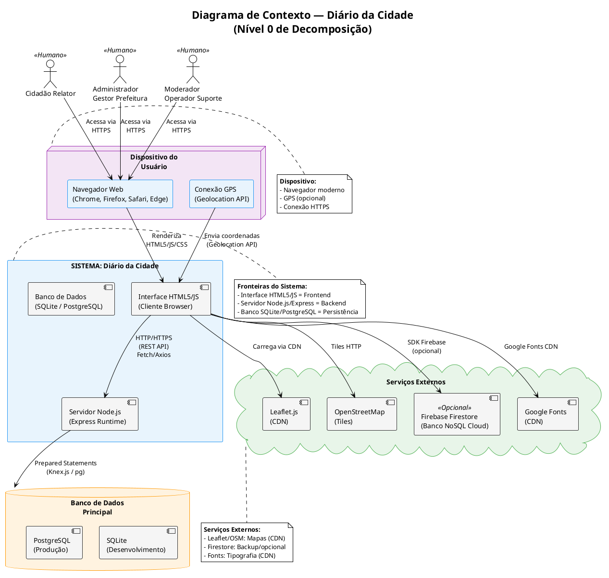
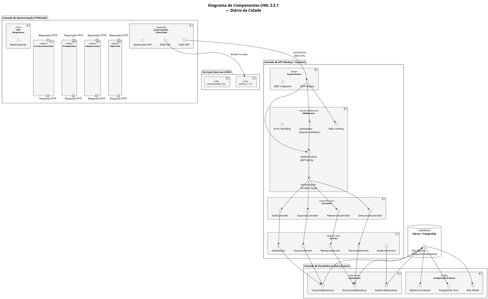
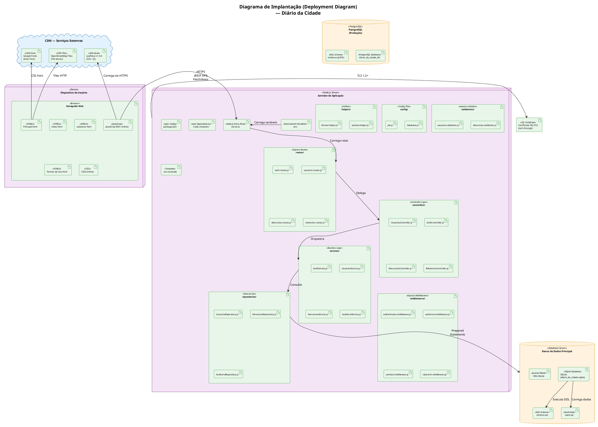
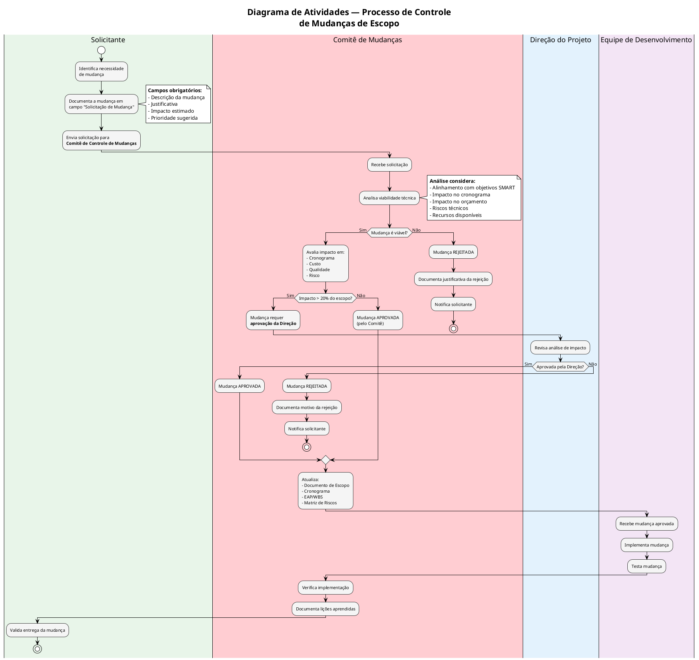

# Escopo do Projeto — Diário da Cidade

**Projeto:** Diário da Cidade — Plataforma de Denúncias Urbanas  
**Versão:** 1.0  
**Data:** 02 de setembro de 2026  
**Conformidade:** PMBOK 7ª Edição, UML 2.5.1, ISO/IEC/IEEE 29148:2018  
**Cidade-Alvo:** Barra do Garças — MT  

---

## Sumário

1. [Justificativa e Objetivos SMART](#1-justificativa-e-objetivos-smart)
2. [Delimitação das Fronteiras do Sistema](#2-delimitação-das-fronteiras-do-sistema)
3. [Escopo do Produto por Módulos](#3-escopo-do-produto-por-módulos)
4. [Diagrama de Componentes UML 2.5.1](#4-diagrama-de-componentes-uml-251)
5. [Diagrama de Implantação](#5-diagrama-de-implantação)
6. [Estrutura Analítica do Projeto (EAP/WBS)](#6-estrutura-analítica-do-projeto-eapwbs)
7. [Limites do Projeto](#7-limites-do-projeto)
8. [Matrizes de Controle](#8-matrizes-de-controle)
9. [Governança e Controle de Mudanças](#9-governança-e-controle-de-mudanças)

---

## 1. Justificativa e Objetivos SMART

### 1.1 Justificativa de Engenharia

O projeto **Diário da Cidade** surge da necessidade de modernizar e digitalizar o canal de comunicação entre os cidadãos de Barra do Garças (MT) e a Prefeitura Municipal. Atualmente, a população enfrenta dificuldades para reportar problemas urbanos como buracos em vias, falta de iluminação pública, acúmulo de lixo e vazamentos de água. Os canais existentes são fragmentados, burocráticos e não oferecem transparência sobre o andamento das demandas.

**Problemas Identificados:**

| # | Problema Urbano | Impacto |
|---|----------------|---------|
| 1 | Buracos na pista e vias danificadas | Risco de acidentes de trânsito, danos veiculares |
| 2 | Falta de quebra-molas ou sinalização | Segurança viária comprometida |
| 3 | Iluminação pública deficiente | Insegurança noturna, criminalidade |
| 4 | Acúmulo de lixo e terrenos baldios | Saúde pública, proliferação de pragas |
| 5 | Vazamentos e problemas de esgoto | Desperdício de água, mau cheiro, riscos sanitários |
| 6 | Falta de canal direto para denúncias | Cidadãos desmotivados a reportar |

**Solução Proposta:**

Uma plataforma web full-stack que permita aos cidadãos:
- Registrar denúncias com localização georreferenciada (mapa interativo)
- Acompanhar o status das denúncias em tempo real
- Acessar transparência sobre as ações da prefeitura

Que permita à administração municipal:
- Gerenciar o ciclo de vida das denúncias
- Atribuir status e encaminhar para órgãos responsáveis
- Gerar relatórios estatísticos para tomada de decisão

### 1.2 Objetivos SMART

| Objetivo | Específico | Mensurável | Atingível | Relevante | Temporal |
|----------|-----------|------------|-----------|-----------|----------|
| **S** — Específico | Implementar plataforma web de denúncias urbanas para Barra do Garças | Sistema completo com frontend HTML5 + backend Node.js + banco SQLite/PostgreSQL | Utilizando stack tecnológica open-source e gratuita | Modernizar canal de denúncias da prefeitura | — |
| **M** — Mensurável | Reduzir o tempo médio de resposta a denúncias em 40% | Métricas de tempo entre criação e resolução de denúncias comparadas ao modelo atual | Com base em dados comparativos antes/depois da implementação | Aumentar a eficiência operacional da prefeitura | — |
| **A** — Atingível | Alcançar 500 denúncias registradas no primeiro mês de operação | Contador de denúncias no sistema | Com base em população estimada e campanha de divulgação | Engajar a comunidade local | — |
| **R** — Relevante | Disponibilizar o sistema para 100% dos cidadãos com acesso à internet na cidade | Acesso público via navegador web em dispositivos móveis e desktop | Considerando taxa de penetração de internet em Barra do Garças | Democratizar o acesso a serviços públicos | — |
| **T** — Temporal | Lançar a versão 1.0 do sistema em 90 dias a partir do início do projeto | Entrega da versão 1.0 com todas as funcionalidades documentadas | Com equipe de 3-5 desenvolvedores | Cumpribir cronograma de entrega | 90 dias corridos |

### 1.3 Alinhamento Estratégico

| Pil Estratégico | Como o Projeto Contribui |
|----------------|------------------------|
| **Transparência Pública** | Toda denúncia é rastreável com status e histórico |
| **Eficiência Operacional** | Painel administrativo automatiza gestão de demandas |
| **Cidadania Ativa** | App web acessível mobiliza cidadãos a reportar problemas |
| **Gestão por Dados** | Relatórios estatísticos orientam decisões da administração |
| **Inclusão Digital** | Interface responsiva acessível em qualquer dispositivo |

---

## 2. Delimitação das Fronteiras do Sistema

### 2.1 Diagrama de Contexto (PlantUML)



### 2.2 Tabela de Fronteiras do Sistema

| Fronteira | Componente | Descrição | Tecnologia |
|-----------|-----------|-----------|------------|
| **Interface HTML5/JS** | Frontend | Apresentação, validação client-side, interação com DOM | HTML5 semântico, CSS3, JavaScript ES6+ |
| **Servidor Node.js** | Backend | API REST, middlewares, lógica de negócio | Node.js + Express |
| **Persistência** | Database | Armazenamento de dados | SQLite (dev) / PostgreSQL (prod) |
| **Geolocalização** | Externo | Coordenadas GPS do dispositivo | Geolocation API (navegador) |
| **Mapa Interativo** | Externo | Renderização de mapa e marcadores | Leaflet.js + OpenStreetMap (CDN) |
| **Autenticação** | Externo | Validação de identidade | JWT (token stateless) |

### 2.3 Ators do Sistema e Seus Limites

| Ator | Limite de Acesso | Pode Acessar | Não Pode Acessar |
|------|-----------------|--------------|------------------|
| Cidadão Relator | Frontend público | Formulário, mapa, lista de denúncias | Painel admin, exclusões, relatórios |
| Administrador | Painel administrativo (autenticado) | Tudo (CRUD completo) | — |
| Moderador | Painel com permissões limitadas | Listar, visualizar, alterar status | Excluir, gerenciar usuários, relatórios |

---

## 3. Escopo do Produto por Módulos

### 3.1 Módulo 1 — Interface do Cidadão (Frontend)

| Entregável | Tipo | Descrição | Arquivo |
|-----------|------|-----------|---------|
| Página de Login | HTML5 | Formulário de autenticação com campos email/senha | `Index.html` |
| Página de Cadastro | HTML5 | Formulário de registro de novo usuário | `cadastrar.html` |
| Página Principal | HTML5 | Mapa interativo + formulário de denúncia + lista | `Principal.html` |
| Página de Termos | HTML5 | Documento legal com 5 seções | `Termos de Uso.html` |
| Estilos CSS | CSS3 | Design responsivo, breakpoints mobile/tablet/desktop | Inline nos HTML |
| Scripts JavaScript | ES6+ | Validação, sanitização, comunicação com API | Inline nos HTML |

### 3.2 Módulo 2 — Servidor Backend (API REST)

| Entregável | Tipo | Descrição | Arquivo |
|-----------|------|-----------|---------|
| Ponto de Entrada | JS | Configuração Express, middlewares globais | `server.js` |
| Rotas de Autenticação | JS | Login, logout, verificação de token | `routes/auth.routes.js` |
| Rotas de Usuários | JS | CRUD de usuários (admin) | `routes/usuarios.routes.js` |
| Rotas de Denúncias | JS | CRUD de denúncias | `routes/denuncias.routes.js` |
| Rotas de Relatórios | JS | Geração de relatórios estatísticos | `routes/relatorios.routes.js` |
| Controller de Auth | JS | Orquestração de autenticação | `controllers/AuthController.js` |
| Controller de Usuários | JS | Orquestração de usuários | `controllers/UsuariosController.js` |
| Controller de Denúncias | JS | Orquestração de denúncias | `controllers/DenunciasController.js` |
| Controller de Relatórios | JS | Orquestração de relatórios | `controllers/RelatoriosController.js` |
| Service de Auth | JS | Lógica de autenticação, JWT, bloqueio | `services/AuthService.js` |
| Service de Usuários | JS | Lógica de negócio de usuários | `services/UsuariosService.js` |
| Service de Denúncias | JS | Lógica de negócio de denúncias | `services/DenunciasService.js` |
| Service de Auditoria | JS | Registro de trilha de auditoria | `services/AuditoriaService.js` |
| Repository de Usuários | JS | Queries parametrizadas de usuários | `repositories/UsuariosRepository.js` |
| Repository de Denúncias | JS | Queries parametrizadas de denúncias | `repositories/DenunciasRepository.js` |
| Repository de Auditoria | JS | Queries de auditoria | `repositories/AuditoriaRepository.js` |
| Middleware de Autenticação | JS | Verificação JWT | `middlewares/authenticate.middleware.js` |
| Middleware de Autorização | JS | Verificação de perfil | `middlewares/authorize.middleware.js` |
| Middleware de Sanitização | JS | Limpeza de input contra XSS | `middlewares/sanitize.middleware.js` |
| Middleware de Rate Limit | JS | Limitação de taxa | `middlewares/rateLimit.middleware.js` |
| Validações | JS | express-validator schemas | `validations/denuncias.validation.js` |
| Helpers | JS | Utilitários (escaparHTML, formatadores) | `helpers/sanitize.helper.js` |

### 3.3 Módulo 3 — Banco de Dados

| Entregável | Tipo | Descrição | Arquivo |
|-----------|------|-----------|---------|
| Schema DDL | SQL | Criação de tabelas, constraints, índices | `database/schema.sql` |
| Seed Data | SQL | Dados iniciais (admin padrão) | `database/seed.sql` |
| Migrations | JS | Controle de versão do schema | `database/migrations/` |
| Configuração | JS | Conexão e pool do banco | `config/database.js` |

### 3.4 Módulo 4 — Configuração e Infraestrutura

| Entregável | Tipo | Descrição | Arquivo |
|-----------|------|-----------|---------|
| Dependências | JSON | Lista de pacotes npm | `package.json` |
| Variáveis de Ambiente | ENV | Configurações de produção | `.env.example` |
| Git Ignore | TEXT | Arquivos ignorados pelo Git | `.gitignore` |
| Documentação | MD | Requisitos e escopo | `*.md` |

---

## 4. Diagrama de Componentes UML 2.5.1

### 4.1 Diagrama de Componentes (PlantUML)



### 4.2 Tabela de Portas e Interfaces

| Componente Provedor | Porta/Interface | Tipo | Componente Requerido | Descrição |
|---------------------|-----------------|------|---------------------|-----------|
| Express Router | HTTP Routes | In | Fetch API | Rotas REST HTTP |
| Middlewares | Authentication | In/Out | Controllers | Verificação JWT |
| Middlewares | Authorization | In/Out | Controllers | Verificação de perfil |
| Middlewares | Sanitization | In/Out | Controllers | Limpeza de input |
| Controllers | UsuariosController | In/Out | UsuariosService | Orquestração de usuários |
| Controllers | AuthController | In/Out | AuthService | Orquestração de auth |
| Controllers | DenunciasController | In/Out | DenunciasService | Orquestração de denúncias |
| Services | UsuariosRepository | In/Out | Database | Queries de usuários |
| Services | DenunciasRepository | In/Out | Database | Queries de denúncias |
| Services | AuditoriaRepository | In/Out | Database | Queries de auditoria |
| Repositories | SQL Queries | In/Out | SQLite/PostgreSQL | Prepared Statements |
| Frontend | Fetch API | In/Out | Express Router | Comunicação HTTP |
| Frontend | DOM API | In/Out | Leaflet.js | Renderização de mapa |

---

## 5. Diagrama de Implantação

### 5.1 Diagrama de Deployment (PlantUML)



### 5.2 Variáveis de Ambiente (.env)

| Variável | Descrição | Valor Padrão | Obrigatória |
|----------|-----------|-------------|-------------|
| `NODE_ENV` | Ambiente de execução | `development` | Sim |
| `PORT` | Porta do servidor | `3000` | Sim |
| `JWT_SECRET` | Chave secreta JWT (mín. 32 bytes) | — | Sim |
| `JWT_EXPIRATION` | Tempo de expiração do token | `24h` | Sim |
| `DB_TYPE` | Tipo do banco de dados | `sqlite` | Sim |
| `DB_HOST` | Host do banco (PostgreSQL) | `localhost` | Não (SQLite) |
| `DB_PORT` | Porta do banco (PostgreSQL) | `5432` | Não (SQLite) |
| `DB_NAME` | Nome do banco de dados | `diario_da_cidade` | Sim |
| `DB_USER` | Usuário do banco (PostgreSQL) | — | Não (SQLite) |
| `DB_PASSWORD` | Senha do banco (PostgreSQL) | — | Não (SQLite) |
| `DB_PATH` | Caminho do arquivo SQLite | `./database/diario_da_cidade.sqlite` | Sim (SQLite) |
| `RATE_LIMIT_WINDOW` | Janela de rate limit (ms) | `60000` | Sim |
| `RATE_LIMIT_MAX` | Máximo de requisições por janela | `100` | Sim |
| `CORS_ORIGIN` | Origem permitida (CORS) | `*` | Sim |
| `LOG_LEVEL` | Nível de log | `info` | Sim |

### 5.3 Estrutura de Diretórios

```
diario-da-cidade/
├── .env                          # Variáveis de ambiente (não版本控制)
├── .env.example                  # Template de variáveis
├── .gitignore                    # Arquivos ignorados pelo Git
├── package.json                  # Dependências npm
├── package-lock.json             # Lock de versões
├── server.js                     # Ponto de entrada do servidor
│
├── config/                       # Configurações
│   ├── database.js               # Conexão com banco de dados
│   └── jwt.js                    # Configuração JWT
│
├── routes/                       # Rotas Express
│   ├── auth.routes.js            # Rotas de autenticação
│   ├── usuarios.routes.js        # Rotas de usuários
│   ├── denuncias.routes.js       # Rotas de denúncias
│   └── relatorios.routes.js      # Rotas de relatórios
│
├── controllers/                  # Controllers (orquestração)
│   ├── AuthController.js         # Controller de autenticação
│   ├── UsuariosController.js     # Controller de usuários
│   ├── DenunciasController.js    # Controller de denúncias
│   └── RelatoriosController.js   # Controller de relatórios
│
├── services/                     # Services (lógica de negócio)
│   ├── AuthService.js            # Serviço de autenticação
│   ├── UsuariosService.js        # Serviço de usuários
│   ├── DenunciasService.js       # Serviço de denúncias
│   ├── AuditoriaService.js       # Serviço de auditoria
│   └── RelatoriosService.js      # Serviço de relatórios
│
├── repositories/                 # Repositories (acesso a dados)
│   ├── UsuariosRepository.js     # Repository de usuários
│   ├── DenunciasRepository.js    # Repository de denúncias
│   └── AuditoriaRepository.js    # Repository de auditoria
│
├── middlewares/                   # Middlewares Express
│   ├── authenticate.middleware.js # Autenticação JWT
│   ├── authorize.middleware.js    # Autorização por perfil
│   ├── sanitize.middleware.js     # Sanitização de input
│   └── rateLimit.middleware.js    # Rate limiting
│
├── validations/                  # Validações
│   ├── denuncias.validation.js   # Validação de denúncias
│   └── usuarios.validation.js    # Validação de usuários
│
├── helpers/                      # Utilitários
│   ├── sanitize.helper.js        # Helpers de sanitização
│   └── format.helper.js          # Helpers de formatação
│
├── database/                     # Banco de dados
│   ├── schema.sql                # Schema DDL
│   ├── seed.sql                  # Dados iniciais
│   ├── migrations/               # Migrations
│   └── diario_da_cidade.sqlite   # Arquivo SQLite (dev)
│
├── public/                       # Arquivos estáticos (servidos pelo Express)
│   ├── Index.html                # Página de login
│   ├── cadastrar.html            # Página de cadastro
│   ├── Principal.html            # Página principal
│   ├── Termos de Uso.html        # Página de termos
│   └── assets/                   # Imagens, ícones, etc.
│       ├── css/
│       │   └── styles.css        # Estilos CSS (opcional: extrair do inline)
│       └── js/
│           └── app.js            # Scripts JS (opcional: extrair do inline)
│
├── scripts/                      # Scripts de manutenção
│   ├── backup.js                 # Script de backup automático
│   ├── seed.js                   # Script de seed de dados
│   └── migrate.js                # Script de migração
│
├── tests/                        # Testes (opcional)
│   ├── unit/                     # Testes unitários
│   └── integration/              # Testes de integração
│
├── docs/                         # Documentação
│   ├── requisitos_de_usuario.md
│   ├── requisitos_de_sistema.md
│   ├── escopo_do_projeto.md
│   └── API.md                    # Documentação da API
│
└── README.md                     # Leitura do projeto
```

---

## 6. Estrutura Analítica do Projeto (EAP/WBS)

### 6.1 EAP Textual Hierárquica

```
1.0 Diário da Cidade — Plataforma de Denúncias Urbanas
│
├── 1.1 Gerenciamento do Projeto
│   ├── 1.1.1 Planejamento
│   │   ├── 1.1.1.1 Documento de Escopo (este documento)
│   │   ├── 1.1.1.2 Documento de Requisitos de Usuário
│   │   ├── 1.1.1.3 Documento de Requisitos de Sistema
│   │   ├── 1.1.1.4 Cronograma Detalhado
│   │   └── 1.1.1.5 Estimativa de Custos
│   ├── 1.1.2 Execução e Monitoramento
│   │   ├── 1.1.2.1 Reuniões de Acompanhamento (semanais)
│   │   ├── 1.1.2.2 Dashboard de Progresso
│   │   └── 1.1.2.3 Registro de Riscos
│   └── 1.1.3 Encerramento
│       ├── 1.1.3.1 Documento de Aceite Final
│       ├── 1.1.3.2 Lições Aprendidas
│       └── 1.1.3.3 Handover Operacional
│
├── 1.2 Design e Arquitetura
│   ├── 1.2.1 Arquitetura do Sistema
│   │   ├── 1.2.1.1 Diagrama de Contexto
│   │   ├── 1.2.1.2 Diagrama de Componentes
│   │   ├── 1.2.1.3 Diagrama de Implantação
│   │   └── 1.2.1.4 Escolha de Stack Tecnológica
│   ├── 1.2.2 Design de Interface
│   │   ├── 1.2.2.1 Wireframes (Mobile e Desktop)
│   │   ├── 1.2.2.2 Paleta de Cores e Tipografia
│   │   ├── 1.2.2.3 Componentes Reutilizáveis
│   │   └── 1.2.2.4 Protótipo Interativo
│   └── 1.2.3 Design de Banco de Dados
│       ├── 1.2.3.1 Modelo Entidade-Relacionamento
│       ├── 1.2.3.2 Schema DDL
│       ├── 1.2.3.3 Índices e Otimização
│       └── 1.2.3.4 Estratégia de Backup
│
├── 1.3 Desenvolvimento do Frontend
│   ├── 1.3.1 Estrutura HTML5
│   │   ├── 1.3.1.1 Index.html (Login)
│   │   ├── 1.3.1.2 cadastrar.html (Cadastro)
│   │   ├── 1.3.1.3 Principal.html (Mapa + Formulário + Lista)
│   │   └── 1.3.1.4 Termos de Uso.html
│   ├── 1.3.2 Estilização CSS3
│   │   ├── 1.3.2.1 Design Responsivo
│   │   ├── 1.3.2.2 Breakpoints Mobile/Tablet/Desktop
│   │   ├── 1.3.2.3 Componentes UI (Botões, Cards, Modais, Toasts)
│   │   └── 1.3.2.4 Acessibilidade (WCAG 2.1)
│   ├── 1.3.3 Lógica JavaScript
│   │   ├── 1.3.3.1 Validação Client-Side
│   │   ├── 1.3.3.2 Sanitização XSS
│   │   ├── 1.3.3.3 Comunicação Fetch API
│   │   ├── 1.3.3.4 Integração Leaflet.js (Mapa)
│   │   ├── 1.3.3.5 Geolocation API (GPS)
│   │   └── 1.3.3.6 Gerenciamento de Toast/Modais
│   └── 1.3.4 Testes Frontend
│       ├── 1.3.4.1 Testes de Compatibilidade Cross-Browser
│       ├── 1.3.4.2 Testes de Responsividade
│       └── 1.3.4.3 Testes de Acessibilidade
│
├── 1.4 Desenvolvimento do Backend
│   ├── 1.4.1 Configuração do Servidor
│   │   ├── 1.4.1.1 server.js (Ponto de Entrada)
│   │   ├── 1.4.1.2 package.json (Dependências)
│   │   ├── 1.4.1.3 .env (Variáveis de Ambiente)
│   │   └── 1.4.1.4 Configuração de CORS e Helmet
│   ├── 1.4.2 Middlewares
│   │   ├── 1.4.2.1 Autenticação JWT
│   │   ├── 1.4.2.2 Autorização por Perfil
│   │   ├── 1.4.2.3 Sanitização de Input
│   │   ├── 1.4.2.4 Rate Limiting
│   │   ├── 1.4.2.5 Tratamento de Erros Globais
│   │   └── 1.4.2.6 Logging e Auditoria
│   ├── 1.4.3 Controllers
│   │   ├── 1.4.3.1 AuthController
│   │   ├── 1.4.3.2 UsuariosController
│   │   ├── 1.4.3.3 DenunciasController
│   │   └── 1.4.3.4 RelatoriosController
│   ├── 1.4.4 Services
│   │   ├── 1.4.4.1 AuthService (JWT, bloqueio)
│   │   ├── 1.4.4.2 UsuariosService (CRUD, validações)
│   │   ├── 1.4.4.3 DenunciasService (CRUD, transições)
│   │   ├── 1.4.4.4 AuditoriaService (trilha)
│   │   └── 1.4.4.5 RelatoriosService (estatísticas)
│   ├── 1.4.5 Repositories
│   │   ├── 1.4.5.1 UsuariosRepository (queries parametrizadas)
│   │   ├── 1.4.5.2 DenunciasRepository (queries parametrizadas)
│   │   └── 1.4.5.3 AuditoriaRepository (queries)
│   ├── 1.4.6 Rotas e Validações
│   │   ├── 1.4.6.1 auth.routes.js
│   │   ├── 1.4.6.2 usuarios.routes.js
│   │   ├── 1.4.6.3 denuncias.routes.js
│   │   ├── 1.4.6.4 relatorios.routes.js
│   │   └── 1.4.6.5 Schemas de Validação (express-validator)
│   └── 1.4.7 Testes Backend
│       ├── 1.4.7.1 Testes Unitários (Services)
│       ├── 1.4.7.2 Testes de Integração (API)
│       └── 1.4.7.3 Testes de Segurança (OWASP)
│
├── 1.5 Banco de Dados
│   ├── 1.5.1 Configuração
│   │   ├── 1.5.1.1 config/database.js
│   │   ├── 1.5.1.2 SQLite (Desenvolvimento)
│   │   └── 1.5.1.3 PostgreSQL (Produção)
│   ├── 1.5.2 Schema e Migrations
│   │   ├── 1.5.2.1 schema.sql (DDL completo)
│   │   ├── 1.5.2.2 seed.sql (dados iniciais)
│   │   └── 1.5.2.3 Sistema de Migrations
│   └── 1.5.3 Otimização
│       ├── 1.5.3.1 Índices de Performance
│       ├── 1.5.3.2 Queries Otimizadas
│       └── 1.5.3.3 Plano de Backup e Recuperação
│
├── 1.6 Segurança
│   ├── 1.6.1 Autenticação e Autorização
│   │   ├── 1.6.1.1 JWT com HS256
│   │   ├── 1.6.1.2 Bloqueio por Tentativas
│   │   └── 1.6.1.3 Controle de Perfil
│   ├── 1.6.2 Proteção de Dados
│   │   ├── 1.6.2.1 Criptografia bcrypt (senhas)
│   │   ├── 1.6.2.2 Sanitização XSS
│   │   ├── 1.6.2.3 Prevenção SQL Injection
│   │   └── 1.6.2.4 HTTPS Obrigatório
│   ├── 1.6.3 Headers de Segurança
│   │   ├── 1.6.3.1 Helmet.js
│   │   ├── 1.6.3.2 Content-Security-Policy
│   │   └── 1.6.3.3 HSTS
│   └── 1.6.4 Auditoria
│       ├── 1.6.4.1 Trilha de Auditoria
│       ├── 1.6.4.2 Logs de Acesso
│       └── 1.6.4.3 Monitoramento de Anomalias
│
└── 1.7 Documentação
    ├── 1.7.1 Documentos Técnicos
    │   ├── 1.7.1.1 requisitos_de_usuario.md
    │   ├── 1.7.1.2 requisitos_de_sistema.md
    │   ├── 1.7.1.3 escopo_do_projeto.md (este documento)
    │   └── 1.7.1.4 API.md (documentação da API)
    ├── 1.7.2 Documentos de Usuário
    │   ├── 1.7.2.1 Guia do Cidadão
    │   ├── 1.7.2.2 Guia do Administrador
    │   └── 1.7.2.3 FAQ (Perguntas Frequentes)
    └── 1.7.3 Documentos de Operação
        ├── 1.7.3.1 Guia de Instalação
        ├── 1.7.3.2 Guia de Deploy
        └── 1.7.3.3 Runbook de Operações
```

### 6.2 Dicionário de Entregáveis

| ID | Entregável | Descrição | Formato | Responsável |
|----|-----------|-----------|---------|-------------|
| 1.1.1.1 | Documento de Escopo | Escopo, limites, EAP, WBS | Markdown | Arquiteto |
| 1.1.1.2 | Requisitos de Usuário | Requisitos, atores, casos de uso | Markdown | Analista |
| 1.1.1.3 | Requisitos de Sistema | Requisitos técnicos, API, DB | Markdown | Arquiteto |
| 1.1.1.4 | Cronograma | Cronograma Gantt do projeto | Excel/MS Project | Gerente |
| 1.2.1.1 | Diagrama de Contexto | Fronteiras do sistema | PlantUML/PNG | Arquiteto |
| 1.2.1.2 | Diagrama de Componentes | Componentes e interfaces | PlantUML/PNG | Arquiteto |
| 1.2.1.3 | Diagrama de Deployment | Infraestrutura de implantação | PlantUML/PNG | Arquiteto |
| 1.3.1.1 | Index.html | Página de login | HTML5 | Desenvolvedor |
| 1.3.1.2 | cadastrar.html | Página de cadastro | HTML5 | Desenvolvedor |
| 1.3.1.3 | Principal.html | Página principal (mapa) | HTML5/JS | Desenvolvedor |
| 1.3.1.4 | Termos de Uso.html | Página de termos legais | HTML5 | Desenvolvedor |
| 1.3.2.1 | Design Responsivo | CSS com breakpoints | CSS3 | Designer |
| 1.4.1.1 | server.js | Ponto de entrada Express | JavaScript | Backend Dev |
| 1.4.3.1-4 | Controllers | Controllers de rotas | JavaScript | Backend Dev |
| 1.4.4.1-5 | Services | Lógica de negócio | JavaScript | Backend Dev |
| 1.4.5.1-3 | Repositories | Queries parametrizadas | JavaScript | Backend Dev |
| 1.5.2.1 | schema.sql | Schema DDL completo | SQL | DBA/Dev |
| 1.5.2.2 | seed.sql | Dados iniciais | SQL | DBA/Dev |
| 1.6.1.1 | JWT Auth | Autenticação JWT | JavaScript | Backend Dev |
| 1.7.1.1-4 | Documentação | Docs técnicos completos | Markdown | Equipe |

---

## 7. Limites do Projeto

### 7.1 Dentro do Escopo (In-Scope)

| # | Item | Descrição |
|---|------|-----------|
| IS-01 | Frontend HTML5 | Interface web completa com HTML5 semântico, CSS3 e JavaScript ES6+ |
| IS-02 | Backend Node.js | API REST com Node.js + Express |
| IS-03 | Banco SQLite | Persistência em SQLite para desenvolvimento e produção inicial |
| IS-04 | Banco PostgreSQL | Suporte a PostgreSQL para produção em escala |
| IS-05 | Autenticação JWT | Login/logout com token stateless |
| IS-06 | Gestão de Usuários | Cadastro, login, perfis (cidadão, admin, moderador) |
| IS-07 | CRUD de Denúncias | Criar, listar, visualizar, atualizar status, excluir denúncias |
| IS-08 | Mapa Interativo | Leaflet.js + OpenStreetMap para seleção e visualização |
| IS-09 | Geolocalização | GPS do dispositivo para preenchimento automático |
| IS-10 | Sanitização XSS | Proteção contra Cross-Site Scripting |
| IS-11 | SQL Injection | Proteção via Prepared Statements |
| IS-12 | Rate Limiting | Limitação de taxa de requisições |
| IS-13 | Auditoria | Trilha de auditoria para operações críticas |
| IS-14 | Relatórios | Relatórios estatísticos básicos (JSON) |
| IS-15 | Design Responsivo | Compatível com mobile, tablet e desktop |
| IS-16 | Documentação | Requisitos, escopo e documentação técnica |
| IS-17 | Termos de Uso | Página legal com 5 seções |
| IS-18 | HTTPS | Comunicação criptografada via TLS 1.2+ |
| IS-19 | Cross-Browser | Compatível com Chrome, Firefox, Safari, Edge |
| IS-20 | Múltiplos Tipos | 5 categorias de problemas urbanos |

### 7.2 Fora do Escopo (Out-of-Scope)

| # | Item | Justificativa |
|---|------|--------------|
| OOS-01 | Aplicativo Mobile Nativo (iOS/Android) | Projeto foca em web app responsivo. App nativo pode ser fase futura. |
| OOS-02 | Upload de Fotos/Vídeos | Requer storage cloud (S3, Firebase Storage) e processamento de mídia. Fase futura. |
| OOS-03 | Notificações Push (Email/SMS) | Requer integração com serviços de e-mail (SendGrid, SES) e SMS (Twilio). Fase futura. |
| OOS-04 | Sistema de Comentários | Funcionalidade social não priorizada na v1.0 |
| OOS-05 | Gamificação/Recompensas | Mecânica de engajamento avançada. Fase futura. |
| OOS-06 | Integração com Redes Sociais | Login via Google/Facebook. Requer OAuth. Fase futura. |
| OOS-07 | Chatbot/IA | Assistente virtual para orientação. Fase futura. |
| OOS-08 | API Pública para Terceiros | API documentada para parceiros. Fase futura. |
| OOS-09 | Sistema de Pesquisa/Opinião | Enquetes e pesquisas de satisfação. Fase futura. |
| OOS-10 | Multi-idioma (i18n) | Suporte a idiomas além do PT-BR. Fase futura. |
| OOS-11 | Modo Offline (PWA) | Service workers e cache. Fase futura. |
| OOS-12 | Analytics Avançado | Google Analytics, heatmaps. Fase futura. |
| OOS-13 | Gestão de Equipamentos | Controle de frota e materiais. Sistema separado. |
| OOS-14 | Portal do Fornecedor | Compras e licitações. Sistema separado. |
| OOS-15 | Integração com GIS Avançado | Análise espacial complexa (ArcGIS, QGIS). Fase futura. |
| OOS-16 | App de Terceiros | Integração com apps como Waze, Google Maps. Fase futura. |
| OOS-17 | Sistema de Agendamento | Agendamento de visitas técnicas. Fase futura. |
| OOS-18 | Gestão de Contratos | Controle de contratos de obra. Sistema separado. |
| OOS-19 | Sistema de Cobrança | Taxas e multas. Sistema financeiro separado. |
| OOS-20 | Migração de Dados | Importação de dados de sistemas legados. Não aplicável. |

---

## 8. Matrizes de Controle

### 8.1 Matriz de Critérios de Aceitação (CA)

| ID | Critério de Aceitação | Método de Verificação | Responsável |
|----|----------------------|----------------------|-------------|
| CA-01 | Cidadão consegue cadastrar conta com sucesso | Teste manual + automação | QA |
| CA-02 | Cidadão consegue fazer login com credenciais válidas | Teste manual | QA |
| CA-03 | Login falha com credenciais inválidas (mesma mensagem por segurança) | Teste manual | QA |
| CA-04 | Conta é bloqueada após 5 tentativas incorretas por 30 min | Teste manual | QA |
| CA-05 | Cidadão consegue selecionar local no mapa | Teste manual (Chrome, Firefox, Safari) | QA |
| CA-06 | Cidadão consegue usar GPS para preencher localização | Teste em dispositivo móvel com GPS | QA |
| CA-07 | Formulário valida todos os campos obrigatórios | Teste manual + boundary analysis | QA |
| CA-08 | Descrição com menos de 10 caracteres é rejeitada | Teste de boundary | QA |
| CA-09 | Descrição com mais de 1000 caracteres é truncada | Teste de boundary | QA |
| CA-10 | Termos de Uso devem ser aceitos para enviar denúncia | Teste manual | QA |
| CA-11 | Denúncia é persistida corretamente no banco de dados | Verificação direta no SQLite | Dev |
| CA-12 | Toast de sucesso é exibido após envio | Teste visual | QA |
| CA-13 | Formulário é resetado após envio | Teste manual | QA |
| CA-14 | Denúncias aparecem no mapa com marcadores | Teste manual | QA |
| CA-15 | Denúncias aparecem na lista ordenadas por data | Teste manual | QA |
| CA-16 | Popup do mapa mostra dados corretos | Teste manual | QA |
| CA-17 | Administrador consegue alterar status de denúncia | Teste manual | QA |
| CA-18 | Transição de status segue a máquina de estados | Teste de todas as transições | QA |
| CA-19 | Resolvido não pode ser alterado | Teste de boundary | QA |
| CA-20 | Exclusão requer confirmação em duas etapas | Teste manual | QA |
| CA-21 | Exclusão com texto incorreta é rejeitada | Teste manual | QA |
| CA-22 | Senhas são armazenadas com hash bcrypt | Verificação no banco de dados | Dev |
| CA-23 | API retorna erro 401 para requisições não autenticadas | Teste com Postman/curl | QA |
| CA-24 | API retorna erro 403 para perfis insuficientes | Teste com Postman/curl | QA |
| CA-25 | Rate limit é aplicado corretamente | Teste de carga | QA |
| CA-26 | XSS é bloqueado em todos os campos de input | Teste com payloads XSS | Security |
| CA-27 | SQL injection é bloqueada em todas as queries | Teste com payloads SQLi | Security |
| CA-28 | Headers de segurança estão presentes | Verificação com curl -I | QA |
| CA-29 | Tempo de resposta da API < 200ms (p95) | Teste de performance | QA |
| CA-30 | Interface é responsiva em mobile, tablet e desktop | Teste em múltiplos dispositivos | QA |

### 8.2 Matriz de Restrições e Premissas

#### Restrições

| ID | Restrição | Tipo | Impacto |
|----|-----------|------|---------|
| R-01 | Equipe de 3-5 desenvolvedores | Recurso | Cronograma dependente da equipe |
| R-02 | Orçamento limitado (ferramentas open-source) | Financeiro | Uso obrigatório de tecnologias gratuitas |
| R-03 | Prazo de 90 dias para entrega | Tempo | Escopo pode precisar de ajustes |
| R-04 | Obrigatório stack Node.js + HTML5 | Técnica | Não é possível mudar de stack |
| R-05 | Banco relacional (SQLite/PostgreSQL) | Técnica | Não é possível usar NoSQL como principal |
| R-06 | Conformidade LGPD | Legal | Dados pessoais devem ser protegidos |
| R-07 | Compatibilidade com navegadores modernos | Técnica | IE11 não suportado |
| R-08 | HTTPS obrigatório | Técnica | Requer certificado SSL |
| R-09 | Backend stateless (JWT) | Técnica | Não é possível usar sessões server-side |
| R-10 | Documentação em PT-BR | Linguística | Todos os textos em português |

#### Premissas

| ID | Premissa | Verificação | Risco se Falsa |
|----|---------|-------------|----------------|
| P-01 | A prefeitura fornecerá dados de teste | Reunião com stakeholder | Impossível testar cenários reais |
| P-02 | Os desenvolvedores conhecem Node.js/Express | Avaliação técnica | Necessário treinamento adicional |
| P-03 | O servidor terá acesso à internet para CDN | Verificação de infra | Impossível carregar Leaflet.js |
| P-04 | O público-alvo possui smartphones com GPS | Pesquisa de mercado | GPS não funcionará para muitos |
| P-05 | A prefeitura designará administradores | Reunião com stakeholder | Sem usuários para testar painel admin |
| P-06 | Não haverá mudança de escopo significativa | Acordo com stakeholder | Atrasos no cronograma |
| P-07 | O projeto terá prioridade sobre outras demandas | Comitê de TI | Atrasos por falta de recursos |
| P-08 | As dependências npm estarão disponíveis | Verificação de rede | Impossível instalar pacotes |

### 8.3 Matriz de Riscos Técnicos

| ID | Risco | Probabilidade | Impacto | Classificação | Plano de Mitigação |
|----|-------|:------------:|:-------:|:-------------:|-------------------|
| RT-01 | **Event Loop Blocking** — Operações síncronas bloqueiam o Event Loop do Node.js, causando lentidão generalizada | Média | Alto | Crítico | Usar exclusivamente operações assíncronas (`async/await`). Nunca usar `fs.readFileSync()` ou `child_process.execSync()`. Implementar monitoramento de event loop lag. Usar `worker_threads` para CPU-intensive. |
| RT-02 | **Injeção de Código (XSS)** — Atacante injeta scripts maliciosos em campos de formulário | Alta | Alto | Crítico | Sanitização em dupla camada: `express-validator` (backend) + `textContent` (frontend). Helmet.js com CSP. Testes com payloads OWASP. Nunca usar `innerHTML`. |
| RT-03 | **SQL Injection** — Atacante manipula queries SQL para acessar/modificar dados | Média | Crítico | Crítico | Prepared Statements em todas as queries. Nunca concatenar strings SQL. Usar Knex.js ou ORM. Validação de input antes de queries. |
| RT-04 | **Concorrência de I/O** — Múltiplas requisições sobrecarregam o banco de dados | Média | Alto | Alto | Connection pooling (máx 20 conexões). Queries otimizadas com índices. Cache de leitura (Redis opcional). Timeout em queries. |
| RT-05 | **Exposição de Chaves Secretas** — JWT_SECRET ou credenciais expostas no código | Baixa | Crítico | Crítico | Variáveis de ambiente via `.env`. Nunca committar `.env`. Gitignore configurado. Revisão de código. |
| RT-06 | **Senhas em Texto Puro** — Senhas armazenadas sem criptografia | Baixa | Crítico | Crítico | bcrypt com cost factor 12. Nunca armazenar plaintext. Validação de força de senha. |
| RT-07 | **Token JWT Roubado** — Atacante obtém token e acessa sistema | Média | Alto | Alto | Expiração de 24h. HTTP-Only cookies (recomendado). Rate limit no login. Bloqueio por tentativas. |
| RT-08 | **DDoS (Denial of Service)** — Atacante sobrecarrega o servidor com requisições | Média | Alto | Alto | Rate limiting por IP. Helmet.js. Cloudflare (produção). WAF. |
| RT-09 | **Perda de Dados** — Falha no banco corrompe dados | Baixa | Crítico | Alto | Backup diário automatizado. WAL mode (SQLite). Transações ACID. Plano de recuperação. |
| RT-10 | **Falha de CDN** — Leaflet.js ou OSM indisponível | Baixa | Médio | Médio | Fallback local (bundle mínimo). Mensagem de erro amigável. Cache do navegador. |
| RT-11 | **Geolocalização Negada** — Usuário nega acesso ao GPS | Alta | Baixo | Médio | Fallback para seleção manual no mapa. Mensagem explicativa. Não bloquear funcionalidade. |
| RT-12 | **Compatibilidade de Navegador** — Funcionalidade quebra em navegador específico | Média | Médio | Médio | Testes em 4+ navegadores. Progressive Enhancement. Polyfills se necessário. |
| RT-13 | **Escalabilidade** — Sistema não suporta muitos usuários simultâneos | Baixa | Alto | Médio | Arquitetura stateless (JWT). Connection pooling. Monitoramento de performance. Plano de escala horizontal. |
| RT-14 | **Vulnerabilidades de Dependências** — Pacotes npm com CVEs conhecidas | Média | Alto | Alto | `npm audit` periódico. Atualização regular. Snyk/Dependabot. |

---

## 9. Governança e Controle de Mudanças

### 9.1 Processo de Controle de Mudanças de Escopo



### 9.2 Fluxo de Atividades Detalhado

| Etapa | Ator | Atividade | Saída | Prazo |
|-------|------|-----------|-------|-------|
| 1 | Solicitante | Identifica necessidade de mudança | Descrição da mudança | — |
| 2 | Solicitante | Documenta em campo "Solicitação de Mudança" | Formulário preenchido | 2 dias úteis |
| 3 | Solicitante | Envia para Comitê de Mudanças | Solicitacao registrada | 1 dia |
| 4 | Comitê | Reunião de análise (semanal) | Decisão inicial | 1 semana |
| 5 | Comitê | Analisa viabilidade técnica | Relatório de viabilidade | 3 dias úteis |
| 6 | Comitê | Avalia impacto (cronograma, custo, risco) | Matriz de impacto | 2 dias úteis |
| 7 | Comitê | Decide: aprovar, rejeitar ou escalar para Direção | Decisão documentada | 1 dia |
| 8 | Direção | (Se necessário) Revisa e aprova/rejeita | Decisão final | 3 dias úteis |
| 9 | Comitê | Atualiza documentos de escopo e cronograma | Documentos atualizados | 2 dias úteis |
| 10 | Equipe | Implementa mudança aprovada | Código implementado | Conforme estimativa |
| 11 | Equipe | Testa mudança | Testes executados | 2-5 dias |
| 12 | Comitê | Verifica implementação | Aprovação de entrega | 1 dia |
| 13 | Solicitante | Valida entrega | Aceite formal | 2 dias úteis |
| 14 | Comitê | Documenta lições aprendidas | Lições registradas | 1 dia |

### 9.3 Critérios de Aprovação de Mudanças

| Critério | Peso | Nota Mínima | Peso Total |
|----------|:----:|:-----------:|:----------:|
| Alinhamento com objetivos SMART | 25% | 7/10 | 1.75 |
| Viabilidade técnica | 25% | 8/10 | 2.00 |
| Impacto no cronograma (≤10 dias) | 20% | 6/10 | 1.20 |
| Impacto no orçamento (≤15%) | 15% | 6/10 | 0.90 |
| Risco técnico (baixo/médio) | 15% | 7/10 | 1.05 |
| **Total** | **100%** | — | **6.90/10** |

**Regra de Aprovação:**
- Nota ≥ 7.0: Aprovada automaticamente pelo Comitê
- Nota 5.0 - 6.9: Requer análise adicional
- Nota < 5.0: Rejeitada automaticamente

### 9.4 Registro de Mudanças (Template)

| Campo | Descrição |
|-------|-----------|
| **ID** | Sequencial (MUD-001, MUD-002, ...) |
| **Data** | Data da solicitação |
| **Solicitante** | Nome e função do solicitante |
| **Descrição** | Descrição detalhada da mudança |
| **Justificativa** | Por que a mudança é necessária |
| **Impacto estimado** | Cronograma, custo, qualidade |
| **Classificação** | Crítica, Alta, Média, Baixa |
| **Status** | Solicitada, Em Análise, Aprovada, Rejeitada, Implementada |
| **Decisão** | Aprovada/Rejeitada + justificativa |
| **Data de Implementação** | Data efetiva de implementação |
| **Lições Aprendidas** | O que foi aprendido com esta mudança |

---

## Referências Normativas

| Norma | Descrição |
|-------|-----------|
| PMBOK 7ª Edição | Guia do Corpo de Conhecimento em Gerenciamento de Projetos |
| OMG UML 2.5.1 | Unified Modeling Language |
| ISO/IEC/IEEE 29148:2018 | Engenharia de Requisitos |
| ISO/IEC 25010:2011 | Modelo de Qualidade (FURPS+) |
| NIST SP 800-53 | Controles de Segurança |
| OWASP Top 10 | Vulnerabilidades de Segurança |
| LGPD (Lei 13.709/2018) | Lei Geral de Proteção de Dados |

---

**Documento elaborado conforme padrões PMBOK 7ª Edição e UML 2.5.1 para gerenciamento de projetos de software.**
